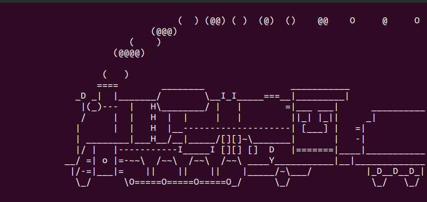

# Writeup

問題文に指定されている場所へSSH接続する。

```bash
ssh welcome@18.176.232.130
password: hitconctf
```

とりあえず、`ls`コマンドを実行。

```bash
$ ls
```



アニメーションが流れる。すごい。

`ls`はダメそうなので、ほかのコマンドを試してみる。

```bash
$ cd /
/bin/sh: 1: dc: not found
```

`cd`コマンドが`dc`として認識されていた。

つまり`ls`を入力したいなら`sl`と入力する必要がある。（先ほどのアニメーションはSL？）

```bash
$ sl
flag
```

```bash
$ tac flag
cat: galf: No such file or directory
```

引数も逆から読む。

```bash
$ tac galf
```

フラグを入手。

<!-- hitcon{!0202 ftcnoctih ot emoclew} -->