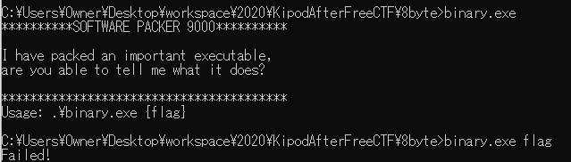

Not Solved :()

# Try

拡張子が`exe`だが一応`file`コマンドで確認。

```bash
$ file binary.exe
binary.exe: PE32 executable (console) Intel 80386, for MS Windows
```

Windows上で実行。



どうやら引数にフラグを入れられれば良いらしい。

`angr`みたいなことができればよいが、`exe`デバッグのノウハウがないのでスキップ。

# Solution