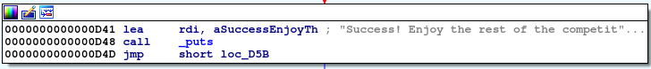

# Writeup

まず、`file` コマンドで形式を確認する。

```bash
$ file SSE_KEYGENME 
SSE_KEYGENME: ELF 64-bit LSB shared object, x86-64, version 1 (SYSV), dynamically linked, interpreter /lib64/ld-linux-x86-64.so.2, for GNU/Linux 3.2.0, BuildID[sha1]=1e5c1dd325c6f4680a3e72d96aba4b57b0da3211, not stripped
```

ELF形式であることが分かるので、実行してみる。

```bash
$ ./SSE_KEYGENME 
###############################
### WELCOME TO SSE_KEYGENME ###
###      ENJOY YOUR STAY    ###
###############################
Enter key:
> hey
Wrong key, try again...
```

`strings`コマンドを実行してみる。

```bash
$ strings SSE_KEYGENME
, "&4More bytes read than expected, exiting...
Input size not multiple of block length, exiting...
###############################
### WELCOME TO SSE_KEYGENME ###
###      ENJOY YOUR STAY    ###
Enter key:
Please enter a key.
Success! Enjoy the rest of the competition :)
Wrong key, try again...
```

とりあえず、正しいkeyを入力できれば先に進めそう。

というわけで、`angr`を使って解く。アドレスはIDAを使って確認した。



[参考]

* https://github.com/saru2017/hxp2018-angrme

```py
import angr

p = angr.Project('SSE_KEYGENME')
main_addr = p.loader.main_object.get_symbol('main').rebased_addr
print('main_addr = ',main_addr)
state = p.factory.entry_state()
sim = p.factory.simulation_manager(state)
addr_success = main_addr + (0xD48-0xC6D)
# addr_failed = main_addr + (0xD4F-0xC6D)
sim.explore(find=addr_success)
if len(sim.found) > 0:
    print(sim.found[0].posix.dumps(0))
```

実行結果がそのままFLAGになっている。

<!-- KAF{F0R_0LD_T1M3S_S4K3} -->