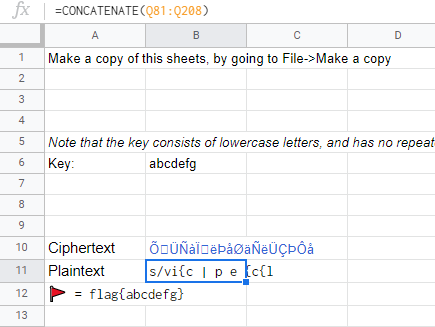
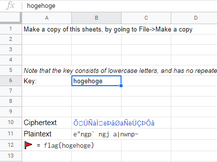
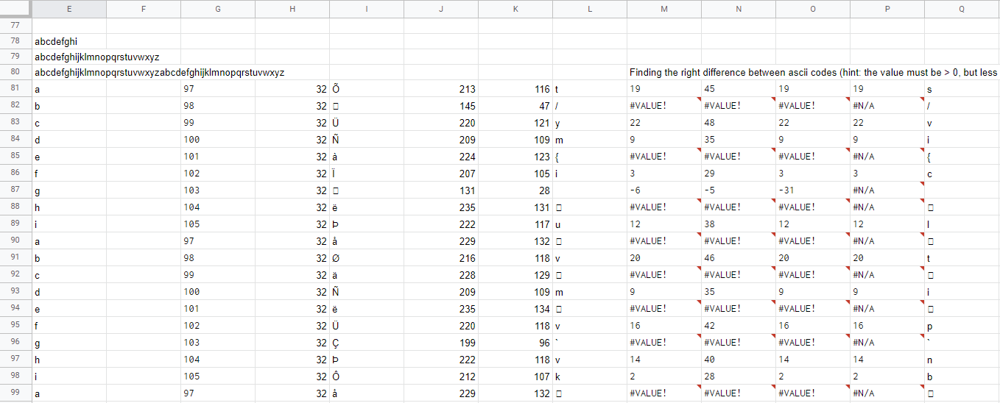
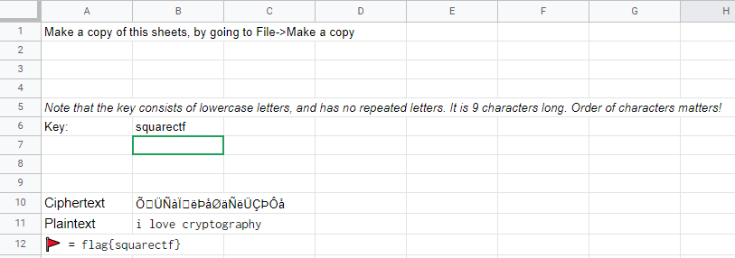

Solved ?

# Try

[リンク](https://docs.google.com/spreadsheets/d/15PFb_fd6xKVIJCF0b0XiiNeilFb-L4jm2uErip1woOM/edit#gid=0)先はGoogle SpreadSheetで、以下のような内容が記載されている。

```
Make a copy of this sheets, by going to File->Make a copy		
		
Note that the key consists of lowercase letters, and has no repeated letters. It is 9 characters long. Order of characters matters!		
Key:	abcdefg	
				
Ciphertext	ՑÜÑàσëÞåØäÑëÜÇÞÔå	
Plaintext	s/vi{cŠ|‚pe„{c{l€	
🚩 = flag{abcdefg}
```

セルの中身を見てみると、`Plaintext`は`CONCATENATE(Q81:Q208)`の値が入ることが分かる。



また、`Key`を変えると`(Q81:Q208)`の値が変わり、`Plaintext`も変化する。そして`Key`がフラグになっているようだ。



81行目から208行目を見てみる。

どうやら白文字にして値を隠しているので文字色を変えてみる。

(key = abcdefghi)


また、`A29`,`M80`には以下のメッセージが隠されている。

```
Hint: can you write an encryption algorithm that undoes the decryption algorithm below?

Finding the right difference between ascii codes (hint: the value must be > 0, but less than 26. Why < 26?) Another hint: we repeat the alphabet at E26!
```

CiphertextとKeyのASCIIコードの差がL列に反映されていて、そのL列をKeyのアルファベット位置(index)分前にRotationしたものがPlaintextになっている。

`Plaintext = ROT(chr((ord(cipertext) - ord(key))), -index(key))`

これを踏まえると暗号化は、

`Ciphertext = chr(ord(key)+ord(ROT(plaintext,index(key))))`

と書ける。

暗号化の方法が分かったので、plaintextが分かればkeyも分かるのだが...

keyの9文字の単語で思い当たった`squarectf`を試しに入れてみると、



偶然それっぽくなってしまった。 どうやるのが正攻法なのだろうか...。

<!-- flag{squarectf} -->
