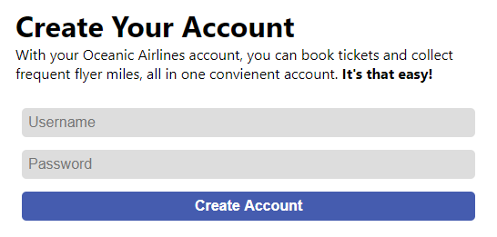

# Writeup

指定のURLに移動するとSign upが求められる。

いろいろ試すと、パスワードの条件が厳しいことがわかる。

* `a`
    * Password is too short.
        * 8文字以上にする

* `aaaaaaaa`
    * Password must include more than two special characters.
        * 2つ以上の特殊文字を入れる

* `aaaa////`
    * Password must include a prime amount of numbers.
        * 素数個の数字を入れる

* `aaaa////123`
    * Password must have equal amount of uppercase and lowercase characters.
        * 大文字と小文字の数を一致させる

* `aaAA////123`
    * Password must include an emoji.
        * 絵文字を入れる

* `aaAA////123⭐`
    *  Password's MD5 hash must start with a number
        * MD5にしたとき数字から始まるようにする

* `123AAaa////⭐`
    * Password must be valid JavaScript that evaluates to True.
        * javascriptでTrueと評価される値にする

* `'123AAaa'!='⭐'`
    * Password must be a palindrome.
        * 回文にする

* `'⭐'=='⭐'||'aA'*1==1*'Aa'||'⭐'=='⭐'`
    * Password is too long.
        * 短くする

* `'⭐'=='⭐'||aA*1==1*Aa||'⭐'=='⭐'`

⇒　成功

Javascriptの条件が厄介だったので、https://playcode.io/ で確認しながら操作

<!-- sun{Pal1ndr0m1c_EcMaScRiPt} -->