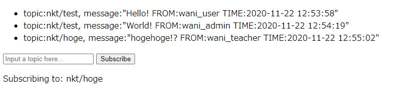

# Writeup

サブスクライブした topic の内容を表示する仕組みになっている。

さすがに `nkt/flag` ではダメだった。

すべてをサブスクライブに指定したいので、MQTTのワイルドカードについて調べると、`#`を使えばよいことが分かった。

[参考]

* http://devcenter.magellanic-clouds.com/learning/mqtt-spec.html

`#`をサブスクライブするとフラグが取得できた。

`top/secret/himitu/daiji/mitara/dame/zettai/flag` にあるらしい。

<!-- FLAG{mq77_w1ld_c4rd!!!!_af5e29cb23} -->