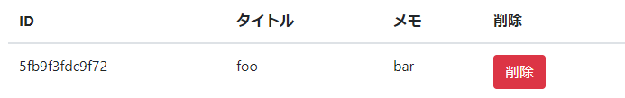

# Writeup

指定のページでは、メモを登録して表示できるようになっている。



どうやら、タイトルとメモの内容が直接表示されているので、`alert(19640503)`が実行できるようにメモの内容に以下を入力して登録する。

```html
<script>alert(19640503);</script>
```

`<script>`タグの内容が実行され、フラグも取得できる。

<!-- FLAG{simple_cross_site_scripting} -->