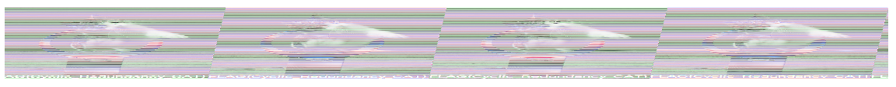

# Writeup

chunk data を見ると、幅と高さ共に0になっている。うまく幅と高さの値を入力すれば復元できそう。

PNGのIDAT部分を抽出してzlib展開をし、フィルタータイプの位置を調べれば幅がわかる。

[参考]

* http://ctf.publog.jp/archives/cat_1182010.html

* https://hoshi-sano.hatenablog.com/entry/2013/08/18/113434

`青い空を見上げればいつもそこに白い猫`を使ってzlibのデータ抽出を行い、バイナリエディタで調べたところ、

`0x0`, `0x95d`, `0x12ba`, `0x1c17` と `0x95d` 間隔で`00`が出現することが分かった。

画像の幅を`95d`にしたところ以下のように表示された。(高さは画像全体が見えるように調整する。)

`00`というフィルタータイプしか見ていないので、4倍分の幅を取ってきてしまった。

そこで、幅を`0x95d / 4 = 0x257`にしたところフラグが鮮明に描かれた画像を得ることができた。

<!-- FLAG{Cyclic_Redundancy_CAT} -->