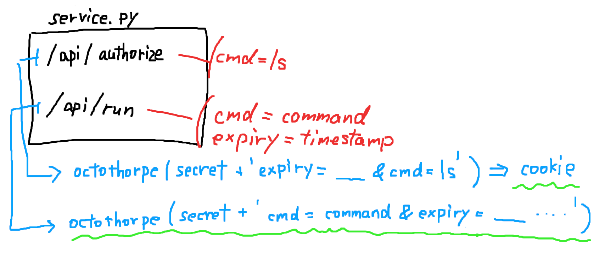

Not Solved :(

# Writeup

リンク先のWebページにアクセスするとフォームが表示される。

デフォルトで入力されている`ls`コマンドを実行してみると以下のような結果が得られる。


コマンドを何でも実行できるわけではなさそう。


リンクの`xz`ファイルを解凍する。中身はどうやらサーバー側のプログラムのようだ。

```bash
tar Jxfv nanothorpe-d2095dcfeda4b08d.tar.xz 
```

Webサーバーのプログラムを見ると、エンドポイントとして`api/authorize`と`api/run`が用意されている。



`api/authorize`ではクエリパラメータに`cmd=ls`を指定すると、有効期限のタイムスタンプと`secret`を使って`signature`を計算する。

`api/run`ではクエリパラメータの`cmd`に指定されている`command`を実行する。ただし、cookieの`signature`と、クエリパラメータと`secret`を使って計算した`signarute`が一致しなければならない。（緑部分）

`cmd=ls`のときは緑部分が一致するので、`ls`のみは標準で実行できる。

任意のコマンドを実行したいなら、`octothorpe(secret + 'query_string')`を`cookie`に設定すれば良さそう。

だが、肝心の`octothorpe`の中身が解読できなかった...

# Solution

# Comment