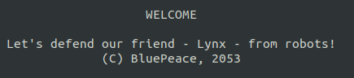

# Writeup

リンク先にブラウザ（Chrome）でアクセスすると以下のように表示される。

CLIベースのWebブラウザである`Lynx`を使えばアクセスできそう。

* https://ja.wikipedia.org/wiki/Lynx_(ウェブブラウザ)

Lynxでこのページへアクセスすると、内容が表示される。

次に、`http://tasks.kksctf.ru:30070/robots.txt`にアクセスすると、`/a4d81e99fda29123aee9d4bb`というディレクトリがあることがわかる。

`http://tasks.kksctf.ru:30070/a4d81e99fda29123aee9d4bb`にアクセスしたらフラグが得られた。

<!-- kks{s0m3_CLI_br0ws3rs_4r3_us3ful} -->