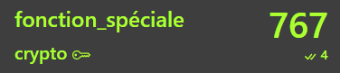

# Writeup

```
f(2522521337)=1215221512112317
f(1215221512112317)=1112111522111511122112131117
f(1112111522111511122112131117)=31123115223115312221121113317
```

上記の関数の法則を探る。8未満の数字しかないので8進数？と考えたが、違うっぽい。

末尾が全部7が気になり、出力は末尾が17になっていることに気づいた。

直感的に、X個の数字Yの並びをXYと書く方式を当てはめてみたら上手くいくことが分かった。

```
例)

f(112223) = 213213

2個の1, 3個の2, 1個の3 = 21 32 13
```


```
f(2229555555768432252223133777492611)=x
```

よって`x`は`321965...`となる。


<!-- ( 1着狙ったが4位だった :( )

 -->

<!-- kks{3219651716181413221532131123371419121621} -->