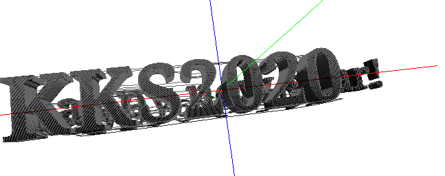
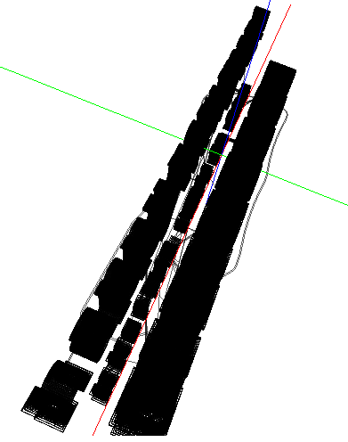

# Writeup

ファイルの中身には以下のような文字列が書かれている。

```
G0 F15000 X9 Y6 Z2
G1 F1500 E-6.5
G0 F4285.7 X66.444 Y105.4 Z0.27
G0 X66.988 Y105.085
G1 F1500 E0
G1 F1200 X71.075 Y103.179 E0.0668
.
.
.
```

調べてみると、これは`G-code`と呼ばれる形式で書かれていることが分かった。3Dプリンターを動かすときに使われているようだ。

* https://note.com/disconosuke/n/n8a3953fdd286

* https://reprap.org/wiki/G-code/ja

オンラインでG-codeを描画してみる。

* http://gcode.ws/





見にくいが、真ん中の列にフラグが描画されている。

* KKS2020

* kks{ <!--W3_c@N_1n_3D!--> }

* Happy new year!

<!-- kks{W3_c@N_1n_3D!} -->