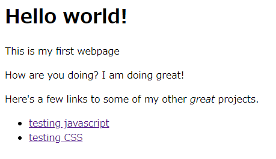

Not solved :(

# Try

提示された5つのリンクのうち、http://34.68.159.75:55275/ だけアクセスできる。

さらに2つリンクがあって、上ではJavaScript、下ではCSSが読み込まれる。



`JavaScript`

```js
// FOrce the user to click okay many times

console.log("uhmm you asked for it!!");

var i;


for (i  = 0; i < 100000;  i++)
  alert("Hello world!1!!!! ");


//ahh you disabled them :*(
//
document.write("Ahh why did you disable those dialogs...? We were having a lot of fun! ;)");
```

```css
@font-face {
    font-family: ComicSans;
    src: url(ComicSansMS3.ttf);
}

body {
  font-family: ComicSans;
}

.bold {
  font-weight: bold;
}

.it {
  font-style: italic;
}

.mono {
  font-family: Monospace;
}
```

手がかりがつかめず...

# Solution