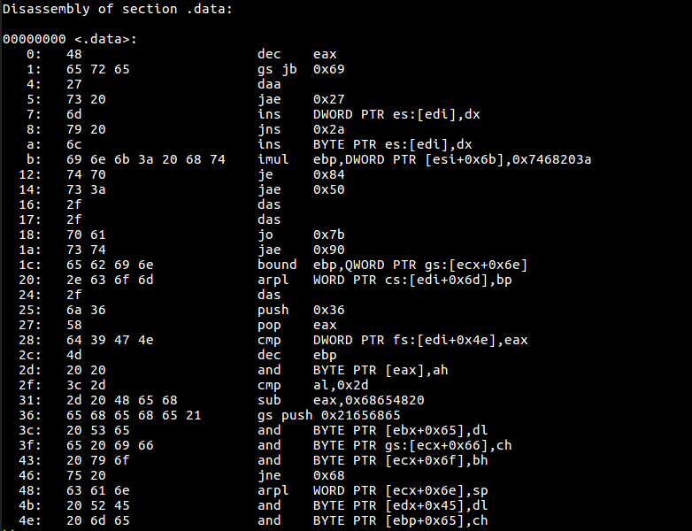

# Writeup

PNGファイルが与えられる。問題タイトルが Not-stego なので、steganography ではないと信じる。

画像を表示すると、アセンブリ言語が書かれている。



命令を見ても何か意味があるように思えない(いきなり`dec`で始まったり、謎のアドレスに`jump`したり)ので、データ部分を文字列に変換してみる。

* [CyberChef](https://gchq.github.io/CyberChef/#recipe=From_Hex('Auto')&input=NDg2NTcyNjUyNzczMjA2ZDc5MjA2YzY5NmU2YjNhMjA2ODc0NzQ3MDczM2EyZjJmNzA2MTczNzQ2NTYyNjk2ZTJlNjM2ZjZkMmY2YTM2NTg2NDM5NDc0ZTRkMjAyMDNjMmQyZDIwNDg2NTY4NjU2ODY1Njg2NTIxMjA1MzY1NjUyMDY5NjYyMDc5NmY3NTIwNjM2MTZlMjA1MjQ1MjA2ZDY1)

すると、以下のメッセージが現れた。

```
Here's my link: https://pastebin.com/j6Xd9GNM  <-- Hehehehe! See if you can RE me
```

リンク先を見るとフラグが書かれている。

<!-- pbctf{3nc0d1ng_w1th_ass3mbly} -->