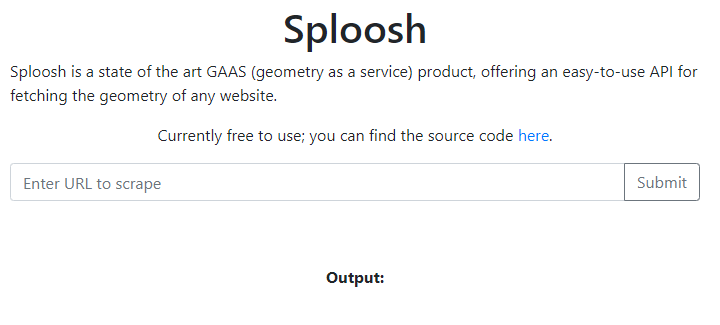

Not solved :(

# Try

リンク先にアクセスすると以下のような画面が表示される。

適当にURLを入力し、Submitすると謎の数字が出力される。

また、このページでソースコードをダウンロードできる。[[source code](dist.zip)]

ユーザーが値をSubmitしたとき、サーバーサイドでの動作は次のようになる。

`index.php`

* `api.php?url=`を呼び出す

`api.php`

* `file_get_contents("http://splash:8050/render.json?timeout=1&url=" . urlencode($url))`を実行する

* 実行結果をJSON形式で返す

    * `{"geometry":[0,0,1024,768]}`

`index.php`

* `api.php`の戻り値を表示する

脆弱性がありそうなのは`api.php`で、ここで`flag.php`を呼び出すことができれば良さそう。
 
| input         | output       |
| ------------- | ------------ |
| ` `           | undefined    |
| `php://input` | null         |
| `flag`        | 0,0,1024,768 |

`file_get_contents`では`scrapinghub/splash`の`render.json`にアクセスしている。

そのため、PHPの実行結果を`geometry`キーの値に設定できないか、Splashのドキュメントを読んで調べる。

* https://splash.readthedocs.io/en/stable/api.html

# Solution

