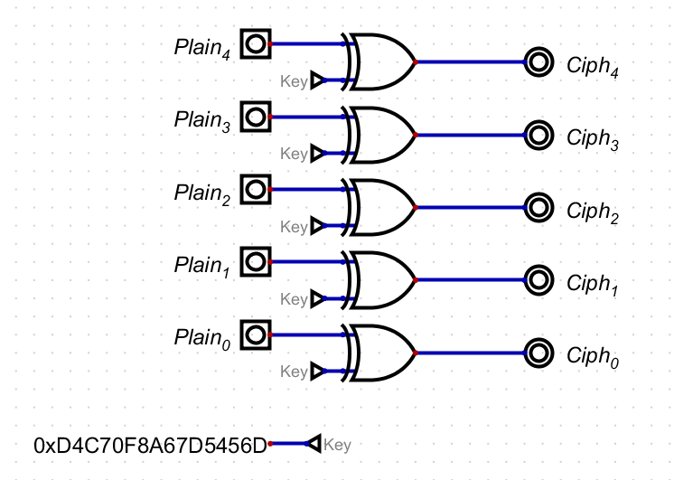

# Writeup

digファイルと以下のテキストが与えられる。

```
B6A46EE913B33E19 BCA67BD510B43632 A4B56AFE13AC1A1E BDAA7FE602E4775E EDF63AB850E67010
```

digファイルに対して、Hint 1にあるソフトを使うと回路図が表示される。



どうやら、CipherはPlainとKeyとのXORらしい。

つまり、CipherとKeyのXORを取ればPlainが分かる。

```py
from pwn import *

cipher = open('encrypted.txt','r').read().split(' ')
key = 'd4c70f8a67d5456d'
plain = b''

for c in cipher:
    plain += xor(bytes.fromhex(c),bytes.fromhex(key))

print(plain)
```

<!-- bcactf{that_was_pretty_simple1239152735} -->
