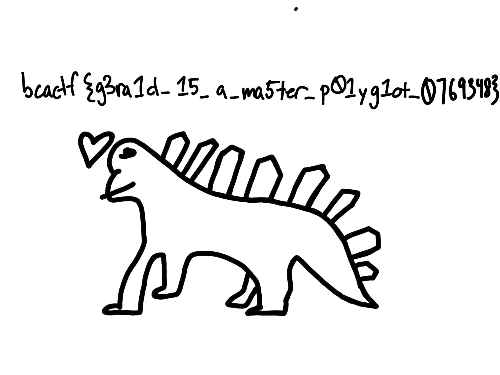

# Writeup

pdfファイルが与えられる。

`binwalk`を使って調べたところ、pngファイルがあることが分かったので展開する。

```bash
$ binwalk gerald.pdf

DECIMAL       HEXADECIMAL     DESCRIPTION
--------------------------------------------------------------------------------
0             0x0             PDF document, version: "1.3"
66            0x42            Zip archive data, at least v2.0 to extract, uncompressed size: 441011, name: GeraldFlag.png
390777        0x5F679         Zip archive data, at least v2.0 to extract, uncompressed size: 367, name: __MACOSX/._GeraldFlag.png
391327        0x5F89F         End of Zip archive, footer length: 22
392072        0x5FB88         Zlib compressed data, default compression
722826        0xB078A         Zlib compressed data, default compression
723219        0xB0913         End of Zip archive, footer length: 22
```

```bash
$ binwalk -e gerald.pdf
```

フラグが書かれた画像ファイルが得られた。



<!-- bcactf{g3ra1d_15_a_ma5ter_p01yg1ot_0769348} -->

