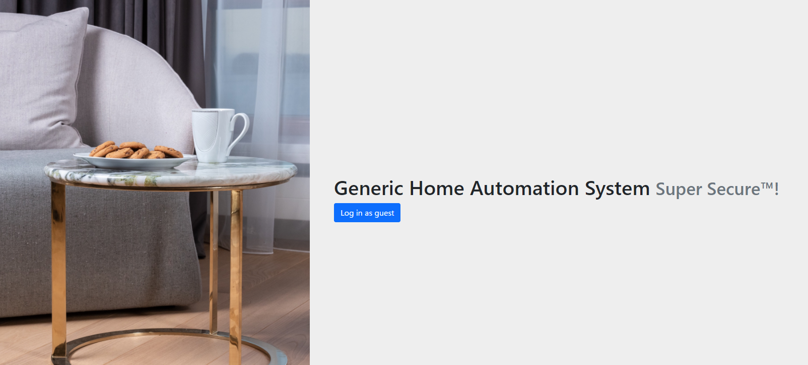
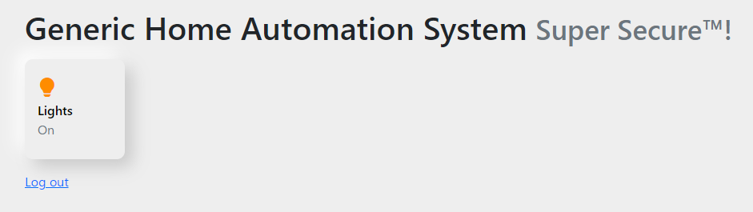

# Writeup

http://web.bcactf.com:49154/ にアクセスする。



[Log in as guest] ボタンを押すと Lights の ON/OFF ボタンが表示される。



OFFにしようとすると、http://web.bcactf.com:49155/off に飛ばされ、

```
You must be admin to turn off the lights. Currently you are "vampire".
```

というメッセージが表示される。

Cookie情報を見ると `user=vampire`となっているので、`user=admin`に書き換える。

ページを再読み込みするとフラグが表示された。

<!-- bcactf{c00k13s_s3rved_fr3sh_fr0m_th3_smart_0ven_cD7EE09kQ} -->
