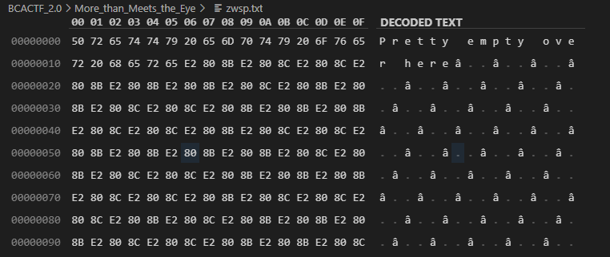

# Writeup

以下のテキストが与えられる。

```
Pretty empty over here​‌‌​​​‌​​‌‌​​​‌‌​‌‌​​​​‌​‌‌​​​‌‌​‌‌‌​‌​​​‌‌​​‌‌​​‌‌‌‌​‌‌​‌‌‌‌​‌​​​‌‌​​‌‌​‌‌‌​​‌​​​‌‌​​​​​‌​‌‌‌‌‌​‌‌‌​‌‌‌​​‌‌​​​‌​‌‌​​‌​​​‌‌‌​‌​​​‌‌​‌​​​​‌​‌‌‌‌‌​‌‌​‌​‌​​‌‌‌​‌​‌​‌‌​‌‌‌​​‌‌​​‌‌‌​‌‌​‌‌​​​​‌‌​​‌‌​‌​‌‌‌‌‌​‌‌​‌​‌​​​‌‌‌​​​​​‌‌​​‌​​‌‌​​​​‌​‌‌‌‌​​​​‌​​‌​​​​​‌‌​‌​​​‌‌‌‌‌​‌.
```

バイナリエディタで見ると、何か書かれていることが分かる。



ZWSPで検索すると、**`ゼロ幅スペース`**の意味であることが分かった。

* https://ja.wikipedia.org/wiki/ゼロ幅スペース

このテキストには `U+200B = E2808B` と `U+200C = E2808C` のみが含まれているので、これを`0,1`に変換して文字列にする。

```py
from Crypto.Util.number import *

text = open('zwsp.txt','rb').read()

binary = ''
for i,t in enumerate(text):
    if(t == 0xe2):
        if(text[i:i+3] == b'\xe2\x80\x8b'):
            binary += '0'
        else:
            binary += '1'

print(long_to_bytes(int(binary,2)))
```

<!-- bcactf{z3r0_w1dth_jungl3_j82axH4} -->
