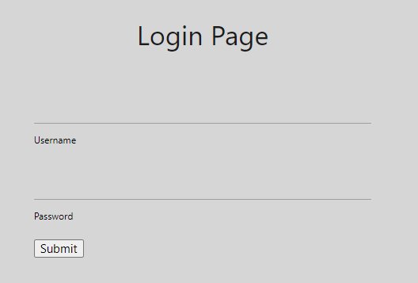

# Writeup

http://web.bcactf.com:49153/ にアクセスする。

`Movie-Login-1`と同様にログイン画面が表示される。



問題に添付されているjsonファイルは以下のようになっており、ここに書かれている文字は使えないようになっている。

```json
[
    "1",
    "0",
    "/",
    "="
]
```

`username = admin`, パスワードを以下のようにしたらログインできた。

```
2' or '3' > '2
```

<!-- bcactf{h0w_d1d_y0u_g3t_h3r3_th1s_t1m3?!?} -->
