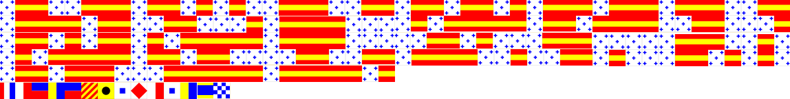

# Writeup

以下の画像が与えられる。



国旗のような部分は 国際信号旗 のマークであることが分かった。

* https://ja.wikipedia.org/wiki/国際信号旗

解読すると、 

```
011001110110101001110011011011010111011101110011
011110110011000101111000010111110110111100110001
011010110101111101111000001101000111000001110010
010111110110110000110011011110010011010001101010
011011100011111101111101
THEKEYISFHSKDN
```

となる。

```py
from Crypto.Util.number import *
from pwn import *

c = b'011001110110101001110011011011010111011101110011011110110011000101111000010111110110111100110001011010110101111101111000001101000111000001110010010111110110110000110011011110010011010001101010011011100011111101111101'
key = b'FHSKDN'

print(long_to_bytes(int(c,2)))

# Vigenere Decode with key FHSKDN
# 
# https://gchq.github.io/CyberChef/#recipe=Vigen%C3%A8re_Decode('FHSKDN')&input=Z2pzbXdzezF4X28xa194NHByX2wzeTRqbj99
```

バイナリを文字列に変換し、ヴィジュネル暗号で復号化したものがフラグになっていた。

<!-- bcactf{1s_h1s_n4me_g3r4rd?} -->
