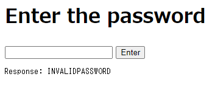

# Writeup

http://web.bcactf.com:49157/ にアクセスする。

パスワード入力フォームが表示されるので、適当に入力してみる。



ソース周りを調べると、`wasm`というファイルを見つけた。

```wasm
(module
  (memory $memory (;0;) (export "memory") 1)
  (func $compareString (;0;) (export "compareString") (param $str1 (;0;) i32) (param $str2 (;1;) i32) (result i32)
    (local $index (;2;) i32)
    loop $label0
      local.get $index
      local.get $str1
      i32.add
      i32.load8_u
      local.get $index
      local.get $str2
      i32.add
      i32.load8_u
      i32.ne
      if
        i32.const 0
        return
      end
      local.get $index
      local.get $str1
      i32.add
      i32.load8_u
      if
        local.get $index
        i32.const 1
        i32.add
        local.set $index
        br $label0
      end
      i32.const 1
      return
    end $label0
    i32.const 0
    return
  )
  (func $checkPassword (;1;) (export "checkPassword") (param $addr (;0;) i32) (result i32)
    block $label0
      local.get $addr
      i32.const 1040
      call $compareString
      br_if $label0
      i32.const 1000
      return
    end $label0
    i32.const 1016
    return
  )
  (data (i32.const 1000) "INVALIDPASSWORD\00bcactf{w4sm-m4g1c-xRz5}\00WASMP4S5W0RD\00")
)
```

ここにそのままフラグが書かれていた。

<!-- bcactf{w4sm-m4g1c-xRz5} -->
