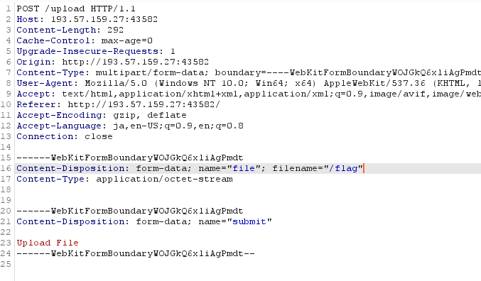

# Writeup

Webページのソースコードが与えられる。

アップロードしたファイルを表示することができるようになっている。

```py
from flask import Flask, request, redirect, g
import sqlite3
import os
import uuid

app = Flask(__name__)

SCHEMA = """CREATE TABLE files (
id text primary key,
path text
);
"""


def db():
    g_db = getattr(g, '_database', None)
    if g_db is None:
        g_db = g._database = sqlite3.connect("database.db")
    return g_db


@app.before_first_request
def setup():
    os.remove("database.db")
    cur = db().cursor()
    cur.executescript(SCHEMA)


@app.route('/')
def hello_world():
    return """<!DOCTYPE html>
<html>
<body>
<form action="/upload" method="post" enctype="multipart/form-data">
    Select image to upload:
    <input type="file" name="file">
    <input type="submit" value="Upload File" name="submit">
</form>

</body>
</html>"""


@app.route('/upload', methods=['POST'])
def upload():
    if 'file' not in request.files:
        return redirect('/')
    file = request.files['file']
    if "." in file.filename:
        return "Bad filename!", 403
    conn = db()
    cur = conn.cursor()
    uid = uuid.uuid4().hex
    try:
        cur.execute("insert into files (id, path) values (?, ?)", (uid, file.filename,))
    except sqlite3.IntegrityError:
        return "Duplicate file"
    conn.commit()
    file.save('uploads/' + file.filename)
    return redirect('/file/' + uid)

@app.route('/file/<id>')
def file(id):
    conn = db()
    cur = conn.cursor()
    cur.execute("select path from files where id=?", (id,))
    res = cur.fetchone()
    if res is None:
        return "File not found", 404
    with open(os.path.join("uploads/", res[0]), "r") as f:
        return f.read()

if __name__ == '__main__':
  app.run(host='0.0.0.0')
```

また、Dockerfileを見るとフラグは`/flag`下にあることが分かる。

```
FROM python:3-alpine
RUN  pip install --no-cache-dir flask gunicorn

RUN addgroup -S ctf && adduser -S ctf -G ctf

COPY app /app
COPY flag.txt /flag
WORKDIR /app

RUN chown -R ctf:ctf /app && chmod -R 770 /app
RUN chown -R root:ctf /app && \
  chmod -R 770 /app

USER ctf
ENTRYPOINT ["/app/start.sh"]
```

ファイル表示部分を読むと、ファイルの読み出しは`filename`指定であることが分かるので、Directory Traversalを行ってみた。

```py
@app.route('/file/<id>')
def file(id):
    conn = db()
    cur = conn.cursor()
    cur.execute("select path from files where id=?", (id,))
    res = cur.fetchone()
    if res is None:
        return "File not found", 404
    with open(os.path.join("uploads/", res[0]), "r") as f:
        return f.read()
```

POSTリクエストのfilenameを改ざんして`/flag`にする。




すると、pathが`/flag`と解釈され、フラグが表示された。

```
>>> import os; os.path.join("uploads/", "/flag")
'/flag'
```

<!-- rarctf{4lw4y5_r34d_th3_d0c5_pr0p3rly!-71ed16} -->
