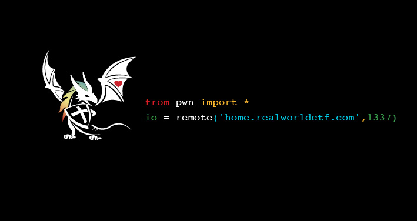

# Writeup

HOME画面(https://realworldctf.com/)のソースコード等々を調べてみると、以下の画像ファイルを発見。



画像の内容に従って接続し、データを受信する。

```py
from pwn import *
io = remote('home.realworldctf.com',1337)
msg = io.recvall()
print(msg.decode('ascii'))
io.close()
```

実行してみるとフラグが表示された。

```bash
                      ^\    ^
                      / \\  / \
                     /.  \\/   \      |\___/|
  *----*           / / |  \\    \  __/  O  O\
  |   /          /  /  |   \\    \_\/  \     \
 / /\/         /   /   |    \\   _\/    '@___@
/  /         /    /    |     \\ _\/       |U
|  |       /     /     |      \\\/        |
\  |     /_     /      |       \\  )   \ _|_
\   \       ~-./_ _    |    .- ; (  \_ _ _,\'
~    ~.           .-~-.|.-*      _        {-,
 \      ~-. _ .-~                 \      /\'
  \                   }            {   .*
   ~.                 '-/        /.-~----.
     ~- _             /        >..----.\\\
         ~ - - - - ^}_ _ _ _ _ _ _.-\\\
__________              .__     __      __            .__       .___ _______________________________
\______   \ ____ _____  |  |   /  \    /  \___________|  |    __| _/ \_   ___ \__    ___/\_   _____/
 |       _// __ \\__  \ |  |   \   \/\/   /  _ \_  __ \  |   / __ |  /    \  \/ |    |   
 |    __)
 |    |   \  ___/ / __ \|  |__  \        (  <_> )  | \/  |__/ /_/ |  \     \____|    |   
 |     \
 |____|_  /\___  >____  /____/   \__/\  / \____/|__|  |____/\____ |   \______  /|____|   
 \___  /
        \/     \/     \/              \/                         \/          \/
     \/
rwctf{1_R3alw0rld;together@HOME}
```

<!-- rwctf{1_R3alw0rld;together@HOME} -->