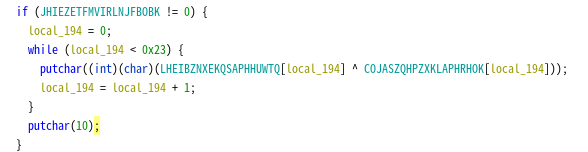

# Writeup

ELFファイルをGhidraを使って解析する。

main関数内の以下の部分でフラグが表示されると推測。




それぞれの配列の中身をXORし、表示される文字列を再現する。

```py
list1 = [0x12,0x18,0x08,0x0a,0x10,0x37,0x37,0x66,0x28,0x17,0x78,0x60,0x67,0x29,0x18,0x26,0x07,0x2b,0x37,0x28,0x0b,0x35,0x76,0x37,0x20,0x11,0x2f,0x37,0x24,0x64,0x37,0x2a,0x7a,0x3e,0x35]
list2 = [0x47,0x55,0x49,0x59,0x43,0x4c,0x5a,0x56,0x45,0x48,0x49,0x50,0x57,0x42,0x47,0x4f,0x58,0x48,0x56,0x46,0x54,0x47,0x45,0x56,0x44,0x4e,0x4e,0x44,0x57,0x57,0x5a,0x48,0x4b,0x47,0x48,0x00]

print("".join([chr(x^y) for x,y in zip(list1,list2)]))
```

<!-- UMASS{m0m_100k_i_can_r3ad_ass3mb1y} -->