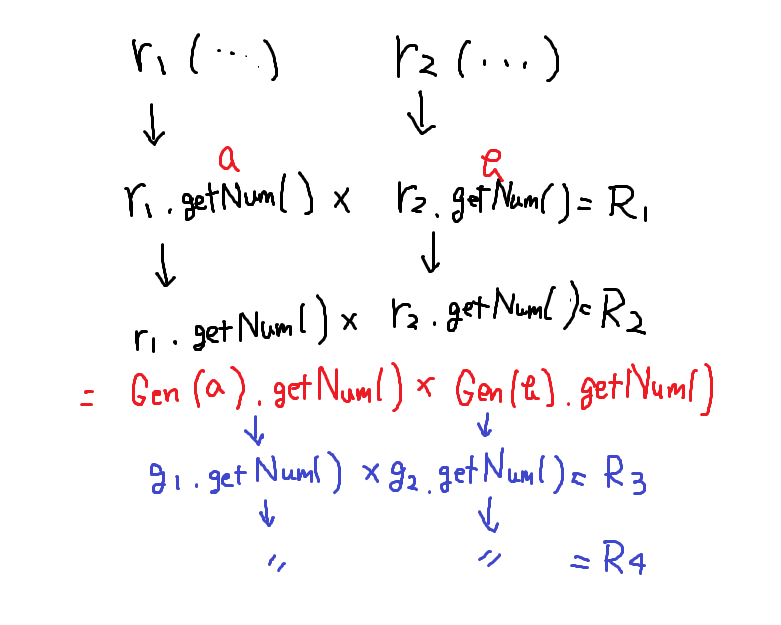

# Writeup

8桁の整数をシードにして生成された2つの乱数の積を当てればフラグが得られる。

```py
r1 = Generator(random.randint(10000000, 99999999))
r2 = Generator(random.randint(10000000, 99999999))

...

if guess != r1.getNum() * r2.getNum():
```

現在のシードをもとに次の乱数を作るので、積を元通りに分解することができればよい。

2つの乱数の積に分解するために素因数分解をする。因数の数が多いと積のパターンが増えるため、リトライする。

正しく分解できているかは、その2つの値をシードにして新しい乱数を生成し、積を確かめればよい。



```py
import os
os.environ['PWNLIB_NOTERM'] = 'True' # sage & pwntools

from pwn import *
import re
import itertools

class Generator():
    DIGITS = 8
    def __init__(self, seed):
        self.seed = seed
        assert(len(str(self.seed)) == self.DIGITS)

    def getNum(self):
        self.seed = int(str(self.seed**2).rjust(self.DIGITS*2, "0")[self.DIGITS//2:self.DIGITS + self.DIGITS//2])
        return self.seed

io = remote('crypto.2021.chall.actf.co','21600')

io.sendline('r')
r1 = int(re.search(r'\d+', io.recvline().decode('utf-8')).group())
print(r1)
io.sendline('r')
r2 = int(re.search(r'\d+', io.recvline().decode('utf-8')).group())
print(r2)
F = factor(r1)
f = [f[0] for f in F for _ in range(f[1])]
if len(f) >= 6:
    io.close()
    exit()
perm = [p for p in itertools.permutations(f)]
found = False
for p in perm :
    a = 1
    for n in p:
        if a * n < 99999999:
            a *= n
        else:
            break
    b = r1 // a
    if 10000000 <= a <= 99999999 and  10000000 <= b <= 99999999:
        g1 = Generator(a)
        g2 = Generator(b)
    else:
        continue
    if(g1.getNum()*g2.getNum() == r2):
        found = True
        break
if found:
    io.sendline('g')
    io.sendline(str(g1.getNum()*g2.getNum()))
    io.sendline(str(g1.getNum()*g2.getNum()))
    io.interactive()
```

```
[x] Opening connection to crypto.2021.chall.actf.co on port 21600
[x] Opening connection to crypto.2021.chall.actf.co on port 21600: Trying 52.207.14.64
[+] Opening connection to crypto.2021.chall.actf.co on port 21600: Done
2390425919415506
1315460154934982
[*] Switching to interactive mode
Would you like to get a random output [r], or guess the next random number [g]? What is your guess to the next value generated? What is your guess to the next value generated? Congrats! Here's your flag: 
actf{middle_square_method_more_like_middle_fail_method}
[*] Got EOF while reading in interactive
```

<!-- actf{middle_square_method_more_like_middle_fail_method} -->