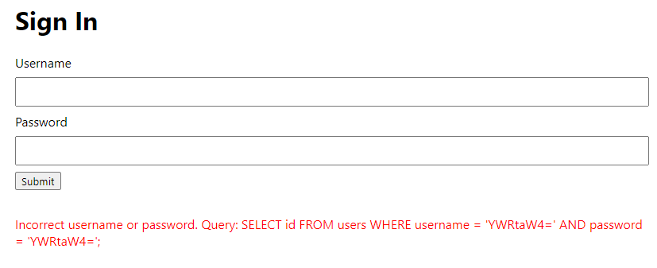
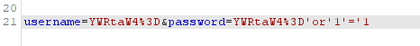
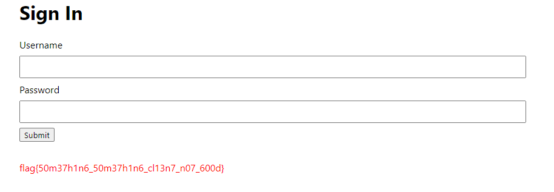

# Writeup

[secure.mc.ax](https://secure.mc.ax/) にアクセスするとログイン画面が表示される。

与えられたソースコードを読むと、UsernameとPasswordはBase64でエンコードされていることが分かる。

```js
db.exec(`INSERT INTO users (username, password) VALUES (
    '${btoa('admin')}',
    '${btoa(crypto.randomUUID)}'
)`);
```

試しに`admin : admin`でログインすると以下のように表示される。



入力フォームからのリクエストでは、`A-Za-z0-9+/=`の文字列しか使用できない。

しかし、実際にBase64に変換しているのはフロントエンドのJavaScript部分なので、POSTリクエストを書き換えて SQL injection を行うことができる。





<!-- flag{50m37h1n6_50m37h1n6_cl13n7_n07_600d} -->
