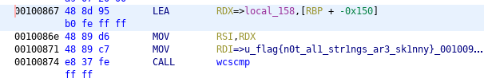

# Writeup

実行ファイルが与えられる。

```bash
$ file wstrings
wstrings: ELF 64-bit LSB shared object, x86-64, version 1 (SYSV), dynamically linked, interpreter /lib64/ld-linux-x86-64.so.2, for GNU/Linux 3.2.0, BuildID[sha1]=97d891ccc43a726635b32182876bf7e39fccd8ce, not stripped
```

実行してみるとフラグの入力を求められる。

```bash
$ ./wstrings
Welcome to flag checker 1.0.
Give me a flag> hoge
```

Ghidraで解析してみると、フラグ文字列と直接比較している部分が見つかった。



<!-- flag{n0t_al1_str1ngs_ar3_sk1nny} -->
